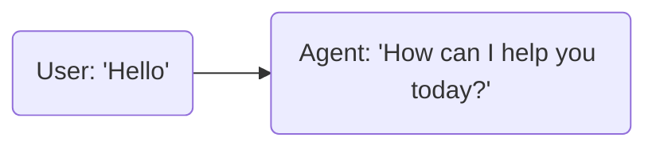
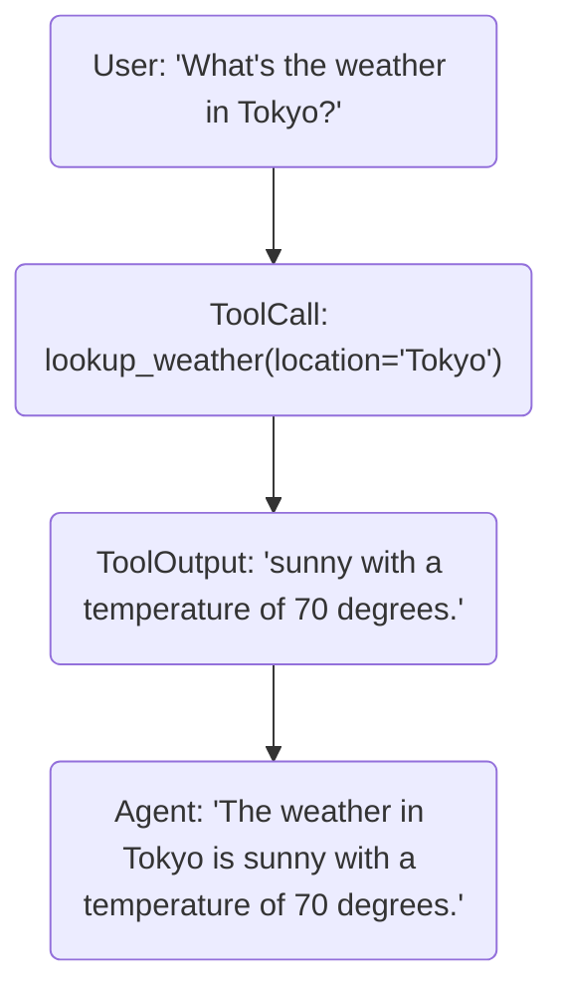

LiveKit Docs › Building voice agents › Overview

---

# Building voice agents

> In-depth guide to voice AI with LiveKit Agents.

## Overview

Building a great voice AI app requires careful orchestration of multiple components. LiveKit Agents is built on top of the [Realtime SDK](https://github.com/livekit/python-sdks) to provide dedicated abstractions that simplify development while giving you full control over the underlying code.

## Agent sessions

The `AgentSession` is the main orchestrator for your voice AI app. The session is responsible for collecting user input, managing the voice pipeline, invoking the LLM, and sending the output back to the user.

Each session requires at least one `Agent` to orchestrate. The agent is responsible for defining the core AI logic - instructions, tools, etc - of your app. The framework supports the design of custom [workflows](https://docs.livekit.io/agents/build/workflows.md) to orchestrate handoff and delegation between multiple agents.

The following example shows how to begin a simple single-agent session:

```python
from livekit.agents import AgentSession, Agent, RoomInputOptions
from livekit.plugins import openai, cartesia, deepgram, noise_cancellation, silero
from livekit.plugins.turn_detector.multilingual import MultilingualModel

session = AgentSession(
    stt=deepgram.STT(),
    llm=openai.LLM(),
    tts=cartesia.TTS(),
    vad=silero.VAD.load(),
    turn_detection=turn_detector.MultilingualModel(),
)

await session.start(
    room=ctx.room,
    agent=Agent(instructions="You are a helpful voice AI assistant."),
    room_input_options=RoomInputOptions(
        noise_cancellation=noise_cancellation.BVC(),
    ),
)

```

### RoomIO

Communication between agent and user participants happens using media streams, also known as tracks. For voice AI apps, this is primarily audio, but can include vision. By default, track management is handled by `RoomIO`, a utility class that serves as a bridge between the agent session and the LiveKit room. When an AgentSession is initiated, it automatically creates a `RoomIO` object that enables all room participants to subscribe to available audio tracks.

To learn more about publishing audio and video, see the following topics:

- **[Agent speech and audio](https://docs.livekit.io/agents/build/audio.md)**: Add speech, audio, and background audio to your agent.

- **[Vision](https://docs.livekit.io/agents/build/vision.md)**: Give your agent the ability to see images and live video.

- **[Text and transcription](https://docs.livekit.io/agents/build/text.md)**: Send and receive text messages and transcription to and from your agent.

- **[Realtime media](https://docs.livekit.io/home/client/tracks.md)**: Tracks are a core LiveKit concept. Learn more about publishing and subscribing to media.

- **[Camera and microphone](https://docs.livekit.io/home/client/tracks/publish.md)**: Use the LiveKit SDKs to publish audio and video tracks from your user's device.

#### Custom RoomIO

For greater control over media sharing in a room,  you can create a custom `RoomIO` object. For example, you might want to manually control which input and output devices are used, or to control which participants an agent listens to or responds to.

To replace the default one created in `AgentSession`, create a `RoomIO` object in your entrypoint function and pass it an instance of the `AgentSession` in the constructor. For examples, see the following in the GitHub repository:

- **[Toggling audio](https://github.com/livekit/agents/blob/main/examples/voice_agents/push_to_talk.py)**: Create a push-to-talk interface to toggle audio input and output.

- **[Toggling input and output](https://github.com/livekit/agents/blob/main/examples/voice_agents/toggle_io.py)**: Toggle both audio and text input and output.

## Voice AI providers

You can choose from a variety of providers for each part of the voice pipeline to fit your needs. The framework supports both high-performance STT-LLM-TTS pipelines and speech-to-speech models. In either case, it automatically manages interruptions, transcription forwarding, turn detection, and more.

You may add these components to the `AgentSession`, where they act as global defaults within the app, or to each individual `Agent` if needed.

- **[TTS](https://docs.livekit.io/agents/integrations/tts.md)**: Text-to-speech integrations

- **[STT](https://docs.livekit.io/agents/integrations/stt.md)**: Speech-to-text integrations

- **[LLM](https://docs.livekit.io/agents/integrations/llm.md)**: Language model integrations

- **[Multimodal](https://docs.livekit.io/agents/integrations/realtime.md)**: Realtime multimodal APIs

## Capabilities

The following guides, in addition to others in this section, cover the core capabilities of the `AgentSession` and how to leverage them in your app.

- **[Workflows](https://docs.livekit.io/agents/build/workflows.md)**: Orchestrate complex tasks among multiple agents.

- **[Tool definition & use](https://docs.livekit.io/agents/build/tools.md)**: Use tools to call external services, inject custom logic, and more.

- **[Pipeline nodes](https://docs.livekit.io/agents/build/nodes.md)**: Add custom behavior to any component of the voice pipeline.

---

This document was rendered at 2025-07-22T06:48:06.891Z.
For the latest version of this document, see [https://docs.livekit.io/agents/build.md](https://docs.livekit.io/agents/build.md).

To explore all LiveKit documentation, see [llms.txt](https://docs.livekit.io/llms.txt).


LiveKit Docs › Building voice agents › Workflows

---

# Workflows

> How to model repeatable, accurate tasks with multiple agents.

## Overview

Agents are composable within a single session to model complex tasks with a high degree of reliability. Some specific scenarios where this is useful include:

- Acquiring recording consent at the beginning of a call.
- Collecting specific structured information, such as an address or a credit card number.
- Moving through a series of questions, one at a time.
- Leaving a voicemail message when the user is unavailable.
- Including multiple personas with unique traits within a single session.

## Defining an agent

Extend the `Agent` class to define a custom agent.

```python
from livekit.agents import Agent

class HelpfulAssistant(Agent):
    def __init__(self):
        super().__init__(instructions="You are a helpful voice AI assistant.")

    async def on_enter(self) -> None:
        await self.session.say("Hello, how can I help you today?")

```

You can also create an instance of `Agent` class directly:

```python
agent = Agent(instructions="You are a helpful voice AI assistant.")

```

## Setting the active agent

Specify the initial agent in the `AgentSession` constructor:

```python
session = AgentSession(
    agent=HelpfulAssistant()
    # ...
)

```

To set a new agent, use the `update_agent` method:

```python
session.update_agent(HelpfulAssistant())

```

## Handing off from tool call

Return a different agent from within a tool call to hand off control automatically. This allows the LLM to make decisions about when handoff should occur. For more information, see [tool return value](https://docs.livekit.io/agents/build/tools.md#return-value).

```python
from livekit.agents import Agent, function_tool, get_job_context

class ConsentCollector(Agent):
    def __init__(self):
        super().__init__(
            instructions="""Your are a voice AI agent with the singular task to collect positive 
            recording consent from the user. If consent is not given, you must end the call."""
        )

    async def on_enter(self) -> None:
        await self.session.say("May I record this call for quality assurance purposes?")

    @function_tool()
    async def on_consent_given(self):
        """Use this tool to indicate that consent has been given and the call may proceed."""

        # Perform a handoff, immediately transfering control to the new agent
        return HelpfulAssistant()

    @function_tool()
    async def end_call(self) -> None:
        """Use this tool to indicate that consent has not been given and the call should end."""
        await self.session.say("Thank you for your time, have a wonderful day.")
        job_ctx = get_job_context()
        await job_ctx.api.room.delete_room(api.DeleteRoomRequest(room=job_ctx.room.name))

```

## Context preservation

By default, each new agent starts with a fresh conversation history for their LLM prompt. To include the prior conversation, set the `chat_ctx` parameter in the `Agent` constructor. You can either copy the prior agent's `chat_ctx`, or construct a new one based on custom business logic to provide the appropriate context.

```python
from livekit.agents import ChatContext, function_tool, Agent

class HelpfulAssistant(Agent):
    def __init__(self, chat_ctx: ChatContext):
        super().__init__(
            instructions="You are a helpful voice AI assistant.",
            chat_ctx=chat_ctx
        )

class ConsentCollector(Agent):
    # ...

    @function_tool()
    async def on_consent_given(self):
        """Use this tool to indicate that consent has been given and the call may proceed."""

        # Pass the chat context during handoff
        return HelpfulAssistant(chat_ctx=self.session.chat_ctx)

```

The complete conversation history for the session is always available in `session.history`.

## Passing state

To store custom state within your session, use the `userdata` attribute. The type of userdata is up to you, but the recommended approach is to use a `dataclass`.

```python
from livekit.agents import AgentSession
from dataclasses import dataclass

@dataclass
class MySessionInfo:
    user_name: str | None = None
    age: int | None = None

```

To add userdata to your session, pass it in the constructor. You must also specify the type of userdata on the `AgentSession` itself.

```python
session = AgentSession[MySessionInfo](
    userdata=MySessionInfo(),
    # ... tts, stt, llm, etc.
)

```

Userdata is available as `session.userdata`, and is also available within function tools on the `RunContext`. The following example shows how to use userdata in an agent workflow that starts with the `IntakeAgent`.

```python
class IntakeAgent(Agent):
    def __init__(self):
        super().__init__(
            instructions="""Your are an intake agent. Learn the user's name and age."""
        )
        
    @function_tool()
    async def record_name(self, context: RunContext[MySessionInfo], name: str):
        """Use this tool to record the user's name."""
        context.userdata.user_name = name
        return self._handoff_if_done()
    
    @function_tool()
    async def record_age(self, context: RunContext[MySessionInfo], age: int):
        """Use this tool to record the user's age."""
        context.userdata.age = age
        return self._handoff_if_done()
    
    def _handoff_if_done(self):
        if self.session.userdata.user_name and self.session.userdata.age:
            return HelpfulAssistant()
        else:
            return None

class HelpfulAssistant(Agent):
    def __init__(self):
        super().__init__(instructions="You are a helpful voice AI assistant.")

    async def on_enter(self) -> None:
        userdata: MySessionInfo = self.session.userdata
        await self.session.generate_reply(
            instructions=f"Greet {userdata.user_name} and tell them a joke about being {userdata.age} years old."
        )

```

## Overriding plugins

You can override any of the plugins used in the session by setting the corresponding attributes in your `Agent` constructor. For instance, you can change the voice for a specific agent by overriding the `tts` attribute:

```python
from livekit.agents import Agent
from livekit.plugins import cartesia

class AssistantManager(Agent):
    def __init__(self):
        super().__init__(
            instructions="You are manager behind a team of helpful voice assistants.",
            tts=cartesia.TTS(voice="6f84f4b8-58a2-430c-8c79-688dad597532")
        )

```

## Examples

These examples show how to build more complex workflows with multiple agents:

- **[Drive-thru agent](https://github.com/livekit/agents/blob/main/examples/drive-thru)**: A complex food ordering agent with tasks, tools, and a complete evaluation suite.

- **[Front-desk agent](https://github.com/livekit/agents/blob/main/examples/frontdesk)**: A calendar booking agent with tasks, tools, and evaluations.

- **[Medical Office Triage](https://github.com/livekit-examples/python-agents-examples/tree/main/complex-agents/medical_office_triage)**: Agent that triages patients based on symptoms and medical history.

- **[Restaurant Agent](https://github.com/livekit/agents/blob/main/examples/voice_agents/restaurant_agent.py)**: A restaurant front-of-house agent that can take orders, add items to a shared cart, and checkout.

## Further reading

For more information on concepts touched on in this article, see the following related articles:

- **[Tool definition and use](https://docs.livekit.io/agents/build/tools.md)**: Complete guide to defining and using tools in your agents.

- **[Nodes](https://docs.livekit.io/agents/build/nodes.md)**: Add custom behavior to any component of the voice pipeline.

- **[Agent speech](https://docs.livekit.io/agents/build/audio.md)**: Customize the speech output of your agents.

- **[Testing & evaluation](https://docs.livekit.io/agents/build/testing.md)**: Test every aspect of your agents with a custom test suite.

---

This document was rendered at 2025-07-22T06:48:19.439Z.
For the latest version of this document, see [https://docs.livekit.io/agents/build/workflows.md](https://docs.livekit.io/agents/build/workflows.md).

To explore all LiveKit documentation, see [llms.txt](https://docs.livekit.io/llms.txt).

LiveKit Docs › Building voice agents › Speech & audio

---

# Agent speech and audio

> Speech and audio capabilities for LiveKit agents.

## Overview

Speech capabilities are a core feature of LiveKit agents, enabling them to interact with users through voice. This guide covers the various speech features and functionalities available for agents.

LiveKit Agents provide a unified interface for controlling agents using both the STT-LLM-TTS pipeline and realtime models.

To learn more and see usage examples, see the following topics:

- **[Text-to-speech (TTS)](https://docs.livekit.io/agents/integrations/tts.md)**: TTS is a synthesis process that converts text into audio, giving AI agents a "voice."

- **[Speech-to-speech](https://docs.livekit.io/agents/integrations/realtime.md)**: Multimodal, realtime APIs can understand speech input and generate speech output directly.

## Preemptive speech generation

**Preemptive generation** allows the agent to begin generating a response before the user's end of turn is committed. The response is based on partial transcription or early signals from user input, helping reduce perceived response delay and improving conversational flow.

When enabled, the agent starts generating a response as soon as the final transcript is available. If the chat context or tools change in the `on_user_turn_completed` [node](https://docs.livekit.io/agents/build/nodes.md#on_user_turn_completed), the preemptive response is canceled and replaced with a new one based on the final transcript.

This feature reduces latency when the following are true:

- [STT node](https://docs.livekit.io/agents/build/nodes.md#stt-node) returns the final transcript faster than [VAD](https://docs.livekit.io/agents/build/turns/vad.md) emits the `end_of_speech` event.
- [Turn detection model](https://docs.livekit.io/agents/build/turns/turn-detector.md) is enabled.

You can enable this feature for STT-LLM-TTS pipeline agents using the `preemptive_generation` parameter for AgentSession:

```python
session = AgentSession(
   preemptive_generation=True,
   ... # STT, LLM, TTS, etc.
)

```

> ℹ️ **Note**
> 
> Preemptive generation doesn't guarantee reduced latency. Use [logging, metrics, and telemetry](https://docs.livekit.io/agents/build/metrics.md)  to validate and fine tune agent performance.

### Example

- **[Preemptive generation example](https://github.com/livekit/agents/blob/main/examples/voice_agents/preemptive_generation.py)**: An example of an agent using preemptive generation.

## Initiating speech

By default, the agent waits for user input before responding—the Agents framework automatically handles response generation.

In some cases, though, the agent might need to initiate the conversation. For example, it might greet the user at the start of a session or check in after a period of silence.

### session.say

To have the agent speak a predefined message, use `session.say()`. This triggers the configured TTS to synthesize speech and play it back to the user.

You can also optionally provide pre-synthesized audio for playback. This skips the TTS step and reduces response time.

> 💡 **Realtime models and TTS**
> 
> The `say` method requires a TTS plugin. If you're using a realtime model, you need to add a TTS plugin to your session or use the [`generate_reply()`](#manually-interrupt-and-generate-responses) method instead.

```python
await session.say(
   "Hello. How can I help you today?",
   allow_interruptions=False,
)

```

#### Parameters

- **`text`** _(str | AsyncIterable[str])_: The text to speak.

 - **`audio`** _(AsyncIterable[rtc.AudioFrame])_ (optional): Pre-synthesized audio to play.

 - **`allow_interruptions`** _(boolean)_ (optional): If `True`, allow the user to interrupt the agent while speaking. (default `True`)

 - **`add_to_chat_ctx`** _(boolean)_ (optional): If `True`, add the text to the agent's chat context after playback. (default `True`)

#### Returns

Returns a [`SpeechHandle`](#speechhandle) object.

#### Events

This method triggers a [`speech_created`](https://docs.livekit.io/agents/build/events.md#speech_created) event.

### generate_reply

To make conversations more dynamic, use `session.generate_reply()` to prompt the LLM to generate a response.

There are two ways to use `generate_reply`:

1. give the agent instructions to generate a response

```python
session.generate_reply(
   instructions="greet the user and ask where they are from",
)

```
2. provide the user's input via text

```python
session.generate_reply(
   user_input="how is the weather today?",
)

```

> ℹ️ **Impact to chat history**
> 
> When using `generate_reply` with `instructions`, the agent uses the instructions to generate a response, which is added to the chat history. The instructions themselves are not recorded in the history.
> 
> In contrast, `user_input` is directly added to the chat history.

#### Parameters

- **`user_input`** _(string)_ (optional): The user input to respond to.

 - **`instructions`** _(string)_ (optional): Instructions for the agent to use for the reply.

 - **`allow_interruptions`** _(boolean)_ (optional): If `True`, allow the user to interrupt the agent while speaking. (default `True`)

#### Returns

Returns a [`SpeechHandle`](#speechhandle) object.

#### Events

This method triggers a [`speech_created`](https://docs.livekit.io/agents/build/events.md#speech_created) event.

## Controlling agent speech

You can control agent speech using the `SpeechHandle` object returned by the `say()` and `generate_reply()` methods, and allowing user interruptions.

### SpeechHandle

The `say()` and `generate_reply()` methods return a `SpeechHandle` object, which lets you track the state of the agent's speech. This can be useful for coordinating follow-up actions—for example, notifying the user before ending the call.

```python

await session.say("Goodbye for now.", allow_interruptions=False)

# the above is a shortcut for 
# handle = session.say("Goodbye for now.", allow_interruptions=False)
# await handle.wait_for_playout()

```

You can wait for the agent to finish speaking before continuing:

```python
handle = session.generate_reply(instructions="Tell the user we're about to run some slow operations.")

# perform an operation that takes time
...

await handle # finally wait for the speech

```

The following example makes a web request for the user, and cancels the request when the user interrupts:

```python
async with aiohttp.ClientSession() as client_session:
    web_request = client_session.get('https://api.example.com/data')
    handle = await session.generate_reply(instructions="Tell the user we're processing their request.")
    if handle.interrupted:
        # if the user interrupts, cancel the web_request too
        web_request.cancel()

```

`SpeechHandle` has an API similar to `ayncio.Future`, allowing you to add a callback:

```python
handle = session.say("Hello world")
handle.add_done_callback(lambda _: print("speech done"))

```

### Getting the current speech handle

The agent session's active speech handle, if any, is available with the `current_speech` property. If no speech is active, this property returns `None`. Otherwise, it returns the active `SpeechHandle`.

Use the active speech handle to coordinate with the speaking state. For instance, you can ensure that a hang up occurs only after the current speech has finished, rather than mid-speech:

```python
# to hang up the call as part of a function call
@function_tool
async def end_call(self, ctx: RunContext):
   """Use this tool when the user has signaled they wish to end the current call. The session ends automatically after invoking this tool."""
   # let the agent finish speaking
   current_speech = ctx.session.current_speech
   if current_speech:
      await current_speech.wait_for_playout()

   # call API to delete_room
   ...

```

### Interruptions

By default, the agent stops speaking when it detects that the user has started speaking. This behavior can be disabled by setting  `allow_interruptions=False` when scheduling speech.

To explicitly interrupt the agent, call the `interrupt()` method on the handle or session at any time. This can be performed even when `allow_interruptions` is set to `False`.

```python
handle = session.say("Hello world")
handle.interrupt()

# or from the session
session.interrupt()

```

## Customizing pronunciation

Most TTS providers allow you to customize pronunciation of words using Speech Synthesis Markup Language (SSML). The following example uses the [tts_node](https://docs.livekit.io/agents/build/nodes.md#tts_node) to add custom pronunciation rules:

** Filename: `agent.py`**

```python
async def tts_node(
    self,
    text: AsyncIterable[str],
    model_settings: ModelSettings
) -> AsyncIterable[rtc.AudioFrame]:
    # Pronunciation replacements for common technical terms and abbreviations.
    # Support for custom pronunciations depends on the TTS provider.
    pronunciations = {
        "API": "A P I",
        "REST": "rest",
        "SQL": "sequel",
        "kubectl": "kube control",
        "AWS": "A W S",
        "UI": "U I",
        "URL": "U R L",
        "npm": "N P M",
        "LiveKit": "Live Kit",
        "async": "a sink",
        "nginx": "engine x",
    }
    
    async def adjust_pronunciation(input_text: AsyncIterable[str]) -> AsyncIterable[str]:
        async for chunk in input_text:
            modified_chunk = chunk
            
            # Apply pronunciation rules
            for term, pronunciation in pronunciations.items():
                # Use word boundaries to avoid partial replacements
                modified_chunk = re.sub(
                    rf'\b{term}\b',
                    pronunciation,
                    modified_chunk,
                    flags=re.IGNORECASE
                )
            
            yield modified_chunk
    
    # Process with modified text through base TTS implementation
    async for frame in Agent.default.tts_node(
        self,
        adjust_pronunciation(text),
        model_settings
    ):
        yield frame

```

** Filename: `Required imports`**

```python
import re
from livekit import rtc
from livekit.agents.voice import ModelSettings
from livekit.agents import tts
from typing import AsyncIterable

```

The following table lists the SSML tags supported by most TTS providers:

| SSML Tag | Description |
| `phoneme` | Used for phonetic pronunciation using a standard phonetic alphabet. These tags provide a phonetic pronunciation for the enclosed text. |
| `say as` | Specifies how to interpret the enclosed text. For example, use `character` to speak each character individually, or `date` to specify a calendar date. |
| `lexicon` | A custom dictionary that defines the pronunciation of certain words using phonetic notation or text-to-pronunciation mappings. |
| `emphasis` | Speak text with an emphasis. |
| `break` | Add a manual pause. |
| `prosody` | Controls pitch, speaking rate, and volume of speech output. |

## Adjusting speech volume

To adjust the volume of the agent's speech, add a processor to the `tts_node` or the `realtime_audio_output_node`.  Alternative, you can also [adjust the volume of playback](https://docs.livekit.io/home/client/tracks/subscribe.md#volume) in the frontend SDK.

The following example agent has an adjustable volume between 0 and 100, and offers a [tool call](https://docs.livekit.io/agents/build/tools.md) to change it.

** Filename: `agent.py`**

```python
class Assistant(Agent):
    def __init__(self) -> None:
        self.volume: int = 50
        super().__init__(
            instructions=f"You are a helpful voice AI assistant. Your starting volume level is {self.volume}."
        )

    @function_tool()
    async def set_volume(self, volume: int):
        """Set the volume of the audio output.

        Args:
            volume (int): The volume level to set. Must be between 0 and 100.
        """
        self.volume = volume

    # Audio node used by STT-LLM-TTS pipeline models
    async def tts_node(self, text: AsyncIterable[str], model_settings: ModelSettings):
        return self._adjust_volume_in_stream(
            Agent.default.tts_node(self, text, model_settings)
        )

    # Audio node used by realtime models
    async def realtime_audio_output_node(
        self, audio: AsyncIterable[rtc.AudioFrame], model_settings: ModelSettings
    ) -> AsyncIterable[rtc.AudioFrame]:
        return self._adjust_volume_in_stream(
            Agent.default.realtime_audio_output_node(self, audio, model_settings)
        )

    async def _adjust_volume_in_stream(
        self, audio: AsyncIterable[rtc.AudioFrame]
    ) -> AsyncIterable[rtc.AudioFrame]:
        stream: utils.audio.AudioByteStream | None = None
        async for frame in audio:
            if stream is None:
                stream = utils.audio.AudioByteStream(
                    sample_rate=frame.sample_rate,
                    num_channels=frame.num_channels,
                    samples_per_channel=frame.sample_rate // 10,  # 100ms
                )
            for f in stream.push(frame.data):
                yield self._adjust_volume_in_frame(f)

        if stream is not None:
            for f in stream.flush():
                yield self._adjust_volume_in_frame(f)

    def _adjust_volume_in_frame(self, frame: rtc.AudioFrame) -> rtc.AudioFrame:
        audio_data = np.frombuffer(frame.data, dtype=np.int16)
        audio_float = audio_data.astype(np.float32) / np.iinfo(np.int16).max
        audio_float = audio_float * max(0, min(self.volume, 100)) / 100.0
        processed = (audio_float * np.iinfo(np.int16).max).astype(np.int16)

        return rtc.AudioFrame(
            data=processed.tobytes(),
            sample_rate=frame.sample_rate,
            num_channels=frame.num_channels,
            samples_per_channel=len(processed) // frame.num_channels,
        )

```

** Filename: `Required imports`**

```python
import numpy as np
from typing import AsyncIterable
from livekit.agents import Agent, function_tool, utils
from livekit.plugins import rtc

```

## Adding background audio

To add more realism to your agent, or add additional sound effects, publish background audio. This audio is played on a separate audio track. The `BackgroundAudioPlayer` class supports on-demand playback of custom audio as well as automatic ambient and thinking sounds synchronized to the agent lifecycle.

For a complete example, see the following recipe:

- **[Background Audio](https://github.com/livekit/agents/blob/main/examples/voice_agents/background_audio.py)**: A voice AI agent with background audio for thinking states and ambiance.

### Create the player

The `BackgroundAudioPlayer` class manages audio playback to a room. It can also play ambient and thinking sounds automatically during the lifecycle of the agent session, if desired.

- **`ambient_sound`** _(AudioSource | AudioConfig | list[AudioConfig])_ (optional): Ambient sound plays on a loop in the background during the agent session. See [Supported audio sources](#audio-sources) and [Multiple audio clips](#multiple-audio-clips) for more details.

- **`thinking_sound`** _(AudioSource | AudioConfig | list[AudioConfig])_ (optional): Thinking sound plays while the agent is in the "thinking" state. See [Supported audio sources](#audio-sources) and [Multiple audio clips](#multiple-audio-clips) for more details.

Create the player within your `entrypoint` function:

```python
from livekit.agents import BackgroundAudioPlayer, AudioConfig, BuiltinAudioClip

# An audio player with automated ambient and thinking sounds
background_audio = BackgroundAudioPlayer(
    ambient_sound=AudioConfig(BuiltinAudioClip.OFFICE_AMBIENCE, volume=0.8),
    thinking_sound=[
        AudioConfig(BuiltinAudioClip.KEYBOARD_TYPING, volume=0.8),
        AudioConfig(BuiltinAudioClip.KEYBOARD_TYPING2, volume=0.7),
    ],
)

# An audio player with a custom ambient sound played on a loop
background_audio = BackgroundAudioPlayer(
    ambient_sound="/path/to/my-custom-sound.mp3",
)

# An audio player for on-demand playback only
background_audio = BackgroundAudioPlayer()

```

### Start and stop the player

Call the `start` method after room connection and after starting the agent session. Ambient sounds, if any, begin playback immediately.

- `room`: The room to publish the audio to.
- `agent_session`: The agent session to publish the audio to.

```python
await background_audio.start(room=ctx.room, agent_session=session)

```

To stop and dispose the player, call the `aclose` method. You must create a new player instance if you want to start again.

```python
await background_audio.aclose()

```

### Play audio on-demand

You can play audio at any time, after starting the player, with the `play` method.

- **`audio`** _(AudioSource | AudioConfig | list[AudioConfig])_: The audio source or a probabilistic list of sources to play. To learn more, see [Supported audio sources](#audio-sources) and [Multiple audio clips](#multiple-audio-clips).

- **`loop`** _(boolean)_ (optional) - Default: `False`: Set to `True` to continuously loop playback.

For example, if you created `background_audio` in the [previous example](#publishing-background-audio), you can play an audio file like this:

```python
background_audio.play("/path/to/my-custom-sound.mp3")

```

The `play` method returns a `PlayHandle` which you can use to await or cancel the playback.

The following example uses the handle to await playback completion:

```python
# Wait for playback to complete
await background_audio.play("/path/to/my-custom-sound.mp3")

```

The next example shows the handle's `stop` method, which stops playback early:

```python
handle = background_audio.play("/path/to/my-custom-sound.mp3")
await(asyncio.sleep(1))
handle.stop() # Stop playback early

```

### Multiple audio clips

You can pass a list of audio sources to any of `play`, `ambient_sound`, or `thinking_sound`. The player selects a single entry in the list based on the `probability` parameter. This is useful to avoid repetitive sound effects. To allow for the possibility of no audio at all, ensure the sum of the probabilities is less than 1.

`AudioConfig` has the following properties:

- **`source`** _(AudioSource)_: The audio source to play. See [Supported audio sources](#audio-sources) for more details.

- **`volume`** _(float)_ (optional) - Default: `1`: The volume at which to play the given audio.

- **`probability`** _(float)_ (optional) - Default: `1`: The relative probability of selecting this audio source from the list.

```python
# Play the KEYBOARD_TYPING sound with an 80% probability and the KEYBOARD_TYPING2 sound with a 20% probability
background_audio.play([
    AudioConfig(BuiltinAudioClip.KEYBOARD_TYPING, volume=0.8, probability=0.8),
    AudioConfig(BuiltinAudioClip.KEYBOARD_TYPING2, volume=0.7, probability=0.2),
])

```

### Supported audio sources

The following audio sources are supported:

#### Local audio file

Pass a string path to any local audio file. The player decodes files with FFmpeg via [PyAV](https://github.com/PyAV-Org/PyAV) and supports all common audio formats including MP3, WAV, AAC, FLAC, OGG, Opus, WebM, and MP4.

> 💡 **WAV files**
> 
> The player uses an optimized custom decoder to load WAV data directly to audio frames, without the overhead of FFmpeg. For small files, WAV is the highest-efficiency option.

#### Built-in audio clips

The following built-in audio clips are available by default for common sound effects:

- `BuiltinAudioClip.OFFICE_AMBIENCE`: Chatter and general background noise of a busy office.
- `BuiltinAudioClip.KEYBOARD_TYPING`: The sound of an operator typing on a keyboard, close to their microphone.
- `BuiltinAudioClip.KEYBOARD_TYPING2`: A shorter version of `KEYBOARD_TYPING`.

#### Raw audio frames

Pass an `AsyncIterator[rtc.AudioFrame]` to play raw audio frames from any source.

## Additional resources

To learn more, see the following resources.

- **[Voice AI quickstart](https://docs.livekit.io/agents/start/voice-ai.md)**: Use the quickstart as a starting base for adding audio code.

- **[Speech related event](https://docs.livekit.io/agents/build/events.md#speech_created)**: Learn more about the `speech_created` event, triggered when new agent speech is created.

- **[LiveKit SDK](https://docs.livekit.io/home/client/tracks/publish.md#publishing-audio-tracks)**: Learn how to use the LiveKit SDK to play audio tracks.

- **[Background audio example](https://github.com/livekit/agents/blob/main/examples/voice_agents/background_audio.py)**: An example of using the `BackgroundAudioPlayer` class to play ambient office noise and thinking sounds.

- **[Text-to-speech (TTS)](https://docs.livekit.io/agents/integrations/tts.md)**: TTS usage and examples for pipeline agents.

- **[Speech-to-speech](https://docs.livekit.io/agents/integrations/realtime.md)**: Multimodal, realtime APIs understand speech input and generate speech output directly.

---

This document was rendered at 2025-07-22T06:50:56.887Z.
For the latest version of this document, see [https://docs.livekit.io/agents/build/audio.md](https://docs.livekit.io/agents/build/audio.md).

To explore all LiveKit documentation, see [llms.txt](https://docs.livekit.io/llms.txt).

LiveKit Docs › Building voice agents › Tool definition & use

---

# Tool definition and use

> Let your agents call external tools and more.

## Overview

LiveKit Agents has full support for LLM tool use. This feature allows you to create a custom library of tools to extend your agent's context, create interactive experiences, and overcome LLM limitations. Within a tool, you can:

- Generate [agent speech](https://docs.livekit.io/agents/build/audio.md) with `session.say()` or `session.generate_reply()`.
- Call methods on the frontend using [RPC](https://docs.livekit.io/home/client/data/rpc.md).
- Handoff control to another agent as part of a [workflow](https://docs.livekit.io/agents/build/workflows.md).
- Store and retrieve session data from the `context`.
- Anything else that a Python function can do.
- [Call external APIs or lookup data for RAG](https://docs.livekit.io/agents/build/external-data.md).

## Tool definition

Add tools to your agent class with the `@function_tool` decorator. The LLM has access to them automatically.

```python
from livekit.agents import function_tool, Agent, RunContext


class MyAgent(Agent):
    @function_tool()
    async def lookup_weather(
        self,
        context: RunContext,
        location: str,
    ) -> dict[str, Any]:
        """Look up weather information for a given location.
        
        Args:
            location: The location to look up weather information for.
        """

        return {"weather": "sunny", "temperature_f": 70}

```

> 💡 **Best practices**
> 
> A good tool definition is key to reliable tool use from your LLM. Be specific about what the tool does, when it should or should not be used, what the arguments are for, and what type of return value to expect.

### Name and description

By default, the tool name is the name of the function, and the description is its docstring. Override this behavior with the `name` and `description` arguments to the `@function_tool` decorator.

### Arguments

The tool arguments are copied automatically by name from the function arguments. Type hints for arguments are included, if present.

Place additional information about the tool arguments, if needed, in the tool description.

### Return value

The tool return value is automatically converted to a string before being sent to the LLM. The LLM generates a new reply or additional tool calls based on the return value. Return `None` or nothing at all to complete the tool silently without requiring a reply from the LLM.

You can return an `Agent` instance to initiate a [handoff within a workflow](https://docs.livekit.io/agents/build/workflows.md#tool-handoff). You can additionally return the result of the original tool call to the LLM by returning a tuple that includes both the `Agent` instance and the result. The tool call and subsequent LLM reply are completed prior to the handoff.

When a handoff occurs, prompt the LLM to inform the user:

```python
@function_tool()
async def my_tool(context: RunContext):
    return SomeAgent(), "Transferring the user to SomeAgent"

```

### RunContext

Tools include support for a special `context` argument. This contains access to the current `session`, `function_call`, `speech_handle`, and `userdata`. Consult the documentation on [speech](https://docs.livekit.io/agents/build/audio.md) and [state within workflows](https://docs.livekit.io/agents/build/workflows.md) for more information about how to use these features.

### Adding tools dynamically

You can exercise more control over the tools available by setting the `tools` argument directly.

To share a tool between multiple agents, define it outside of their class and then provide it to each. The `RunContext` is especially useful for this purpose to access the current session, agent, and state.

Tools set in the `tools` value are available alongside any registered within the class using the `@function_tool` decorator.

```python
from livekit.agents import function_tool, Agent, RunContext

@function_tool()
async def lookup_user(
    context: RunContext,
    user_id: str,
) -> dict:
    """Look up a user's information by ID."""

    return {"name": "John Doe", "email": "john.doe@example.com"}


class AgentA(Agent):
    def __init__(self):
        super().__init__(
            tools=[lookup_user],
            # ...
        )


class AgentB(Agent):
    def __init__(self):
        super().__init__(
            tools=[lookup_user],
            # ...
        )

```

Use `agent.update_tools()` to update available tools after creating an agent. This replaces _all_ tools, including those registered automatically within the agent class. To reference existing tools before replacement, access the `agent.tools` property:

```python
# add a tool
await agent.update_tools(agent.tools + [tool_a])

# remove a tool
await agent.update_tools(agent.tools - [tool_a]) 

# replace all tools
await agent.update_tools([tool_a, tool_b]) 

```

### Creating tools programmatically

To create a tool on the fly, use `function_tool` as a function rather than as a decorator. You must supply a name, description, and callable function. This is useful to compose specific tools based on the same underlying code or load them from external sources such as a database or Model Context Protocol (MCP) server.

In the following example, the app has a single function to set any user profile field but gives the agent one tool per field for improved reliability:

```python
from livekit.agents import function_tool, RunContext

class Assistant(Agent):
    def _set_profile_field_func_for(self, field: str):
        async def set_value(context: RunContext, value: str):
            # custom logic to set input
            return f"field {field} was set to {value}"

        return set_value

    def __init__(self):
        super().__init__(
            tools=[
                function_tool(self._set_profile_field_func_for("phone"),
                              name="set_phone_number",
                              description="Call this function when user has provided their phone number."),
                function_tool(self._set_profile_field_func_for("email"),
                              name="set_email",
                              description="Call this function when user has provided their email."),
                # ... other tools ...
            ],
            # instructions, etc ...
        )

```

### Creating tools from raw schema

For advanced use cases, you can create tools directly from a [raw function calling schema](https://platform.openai.com/docs/guides/function-calling?api-mode=responses). This is useful when integrating with existing function definitions, loading tools from external sources, or working with schemas that don't map cleanly to Python function signatures.

Use the `raw_schema` parameter in the `@function_tool` decorator to provide the full function schema:

```python
from livekit.agents import function_tool, RunContext

raw_schema = {
    "type": "function",
    "name": "get_weather",
    "description": "Get weather for a given location.",
    "parameters": {
        "type": "object",
        "properties": {
            "location": {
                "type": "string",
                "description": "City and country e.g. New York"
            }
        },
        "required": [
            "location"
        ],
        "additionalProperties": False
    }
}

@function_tool(raw_schema=raw_schema)
async def get_weather(raw_arguments: dict[str, object], context: RunContext):
    location = raw_arguments["location"]
    
    # Your implementation here
    return f"The weather of {location} is ..."

```

When using raw schemas, function parameters are passed to your handler as a dictionary named `raw_arguments`. You can extract values from this dictionary using the parameter names defined in your schema.

You can also create tools programmatically using `function_tool` as a function with a raw schemas:

```python
from livekit.agents import function_tool

def create_database_tool(table_name: str, operation: str):
    schema = {
        "type": "function",
        "name": f"{operation}_{table_name}",
        "description": f"Perform {operation} operation on {table_name} table",
        "parameters": {
            "type": "object",
            "properties": {
                "record_id": {
                    "type": "string",
                    "description": f"ID of the record to {operation}"
                }
            },
            "required": ["record_id"]
        }
    }
    
    async def handler(raw_arguments: dict[str, object], context: RunContext):
        record_id = raw_arguments["record_id"]
        # Perform database operation
        return f"Performed {operation} on {table_name} for record {record_id}"
    
    return function_tool(handler, raw_schema=schema)

# Create tools dynamically
user_tools = [
    create_database_tool("users", "read"),
    create_database_tool("users", "update"),  
    create_database_tool("users", "delete")
]

class DataAgent(Agent):
    def __init__(self):
        super().__init__(
            instructions="You are a database assistant.",
            tools=user_tools,
        )

```

## Error handling

Raise the `ToolError` exception to return an error to the LLM in place of a response. You can include a custom message to describe the error and/or recovery options.

```python
@function_tool()
async def lookup_weather(
    self,
    context: RunContext,
    location: str,
) -> dict[str, Any]:
    if location == "mars":
        raise ToolError("This location is coming soon. Please join our mailing list to stay updated.")
    else:
        return {"weather": "sunny", "temperature_f": 70}

```

## Model Context Protocol (MCP)

LiveKit Agents has full support for [MCP](https://modelcontextprotocol.io/) servers to load tools from external sources.

To use it, first install the `mcp` optional dependencies:

```shell
pip install livekit-agents[mcp]~=1.0

```

Then pass the MCP server URL to the `AgentSession` or `Agent` constructor. The tools will be automatically loaded like any other tool.

```python
from livekit.agents import mcp

session = AgentSession(
    #... other arguments ...
    mcp_servers=[
        mcp.MCPServerHTTP(
            "https://your-mcp-server.com"
        )       
    ]       
)

```

```python
from livekit.agents import mcp

agent = Agent(
    #... other arguments ...
    mcp_servers=[
        mcp.MCPServerHTTP(
            "https://your-mcp-server.com"
        )       
    ]       
)

```

## Forwarding to the frontend

Forward tool calls to a frontend app using [RPC](https://docs.livekit.io/home/client/data/rpc.md). This is useful when the data needed to fulfill the function call is only available at the frontend. You may also use RPC to trigger actions or UI updates in a structured way.

For instance, here's a function that accesses the user's live location from their web browser:

### Agent implementation

```python
from livekit.agents import function_tool, get_job_context, RunContext

@function_tool()
async def get_user_location(
    context: RunContext,
    high_accuracy: bool
):
    """Retrieve the user's current geolocation as lat/lng.
    
    Args:
        high_accuracy: Whether to use high accuracy mode, which is slower but more precise
    
    Returns:
        A dictionary containing latitude and longitude coordinates
    """
    try:
        room = get_job_context().room
        participant_identity = next(iter(room.remote_participants))
        response = await room.local_participant.perform_rpc(
            destination_identity=participant_identity,
            method="getUserLocation",
            payload=json.dumps({
                "highAccuracy": high_accuracy
            }),
            response_timeout=10.0 if high_accuracy else 5.0,
        )
        return response
    except Exception:
        raise ToolError("Unable to retrieve user location")

```

### Frontend implementation

The following example uses the JavaScript SDK. The same pattern works for other SDKs. For more examples, see the [RPC documentation](https://docs.livekit.io/home/client/data/rpc.md).

```typescript
import { RpcError, RpcInvocationData } from 'livekit-client';

localParticipant.registerRpcMethod(
    'getUserLocation',
    async (data: RpcInvocationData) => {
        try {
            let params = JSON.parse(data.payload);
            const position: GeolocationPosition = await new Promise((resolve, reject) => {
                navigator.geolocation.getCurrentPosition(resolve, reject, {
                    enableHighAccuracy: params.highAccuracy ?? false,
                    timeout: data.responseTimeout,
                });
            });

            return JSON.stringify({
                latitude: position.coords.latitude,
                longitude: position.coords.longitude,
            });
        } catch (error) {
            throw new RpcError(1, "Could not retrieve user location");
        }
    }
);

```

## Slow tool calls

For best practices on providing feedback to the user during long-running tool calls, see the section on [user feedback](https://docs.livekit.io/agents/build/external-data.md#user-feedback) in the External data and RAG guide.

## External tools and MCP

To load tools from an external source as a Model Context Protocol (MCP) server, use the `function_tool` function and register the tools with the `tools` property or `update_tools()` method. See the following example for a complete MCP implementation:

- **[MCP Agent](https://github.com/livekit-examples/python-agents-examples/tree/main/mcp)**: A voice AI agent with an integrated Model Context Protocol (MCP) server for the LiveKit API.

## Examples

The following additional examples show how to use tools in different ways:

- **[Use of enum](https://github.com/livekit/agents/blob/main/examples/voice_agents/annotated_tool_args.py)**: Example showing how to annotate arguments with enum.

- **[Dynamic tool creation](https://github.com/livekit/agents/blob/main/examples/voice_agents/dynamic_tool_creation.py)**: Complete example with dynamic tool lists.

- **[MCP Agent](https://github.com/livekit-examples/python-agents-examples/tree/main/mcp)**: A voice AI agent with an integrated Model Context Protocol (MCP) server for the LiveKit API.

- **[LiveKit Docs RAG](https://github.com/livekit-examples/python-agents-examples/tree/main/rag)**: An agent that can answer questions about LiveKit with lookups against the docs website.

## Further reading

The following articles provide more information about the topics discussed in this guide:

- **[RPC](https://docs.livekit.io/home/client/data/rpc.md)**: Complete documentation on function calling between LiveKit participants.

- **[Agent speech](https://docs.livekit.io/agents/build/audio.md)**: More information about precise control over agent speech output.

- **[Workflows](https://docs.livekit.io/agents/build/workflows.md)**: Read more about handing off control to other agents.

- **[External data and RAG](https://docs.livekit.io/agents/build/external-data.md)**: Best practices for adding context and taking external actions.

---

This document was rendered at 2025-07-22T06:51:06.444Z.
For the latest version of this document, see [https://docs.livekit.io/agents/build/tools.md](https://docs.livekit.io/agents/build/tools.md).

To explore all LiveKit documentation, see [llms.txt](https://docs.livekit.io/llms.txt).

LiveKit Docs › Building voice agents › Pipeline nodes & hooks

---

# Pipeline nodes and hooks

> Learn how to customize the behavior of your agent with nodes and hooks in the voice pipeline.

## Overview

You can fully customize your agent's behavior at multiple **nodes** in the processing path. A node is a point in the path where one process transitions to another. Some example customizations include:

- Use a custom STT, LLM, or TTS provider without a plugin.
- Generate a custom greeting when an agent enters a session.
- Modify STT output to remove filler words before sending it to the LLM.
- Modify LLM output before sending it to TTS to customize pronunciation.
- Update the user interface when an agent or user finishes speaking.

The `Agent` supports the following nodes and hooks. Some nodes are only available for STT-LLM-TTS pipeline models, and others are only available for realtime models.

Lifecycle hooks:

- `on_enter()`: Called after the agent becomes the active agent in a session.
- `on_exit()`: Called before the agent gives control to another agent in the same session.
- `on_user_turn_completed()`: Called when the user's [turn](https://docs.livekit.io/agents/build/turns.md) has ended, before the agent's reply.

STT-LLM-TTS pipeline nodes:

- `stt_node()`: Transcribe input audio to text.
- `llm_node()`: Perform inference and generate a new conversation turn (or tool call).
- `tts_node()`: Synthesize speech from the LLM text output.

Realtime model nodes:

- `realtime_audio_output_node()`: Adjust output audio before publishing to the user.

Transcription node:

- `transcription_node()`: Access transcription timestamps, or adjust pipeline or realtime model transcription before sending to the user.

The following diagrams show the processing path for STT-LLM-TTS pipeline models and realtime models.

**STT-LLM-TTS pipeline**:


---

**Realtime model**:


## How to implement

Override the method within a custom `Agent` subclass to customize the behavior of your agent at a specific node in the processing path. To use the default, call `Agent.default.<node-name>()`. For instance, this code overrides the STT node while maintaining the default behavior.

```python
async def stt_node(self, audio: AsyncIterable[rtc.AudioFrame], model_settings: ModelSettings) -> Optional[AsyncIterable[stt.SpeechEvent]]:
    # insert custom before STT processing here
    events = Agent.default.stt_node(self, audio, model_settings)
    # insert custom after STT processing here
    return events

```

## Lifecycle hooks

The following lifecycle hooks are available for customization.

### On enter

The `on_enter` node is called when the agent becomes the active agent in a session. Each session can have only one active agent at a time, which can be read from the `session.agent` property. Change the active agent using [Workflows](https://docs.livekit.io/agents/build/workflows.md).

For example, to greet the user:

```python
async def on_enter(self):
    await self.session.generate_reply(
        instructions="Greet the user with a warm welcome",
    )

```

### On exit

The `on_exit` node is called before the agent gives control to another agent in the same session as part of a [workflow](https://docs.livekit.io/agents/build/workflows.md). Use it to save data, say goodbye, or perform other actions and cleanup.

For example, to say goodbye:

```python
async def on_exit(self):
    await self.session.generate_reply(
        instructions="Tell the user a friendly goodbye before you exit.",
    )

```

### On user turn completed

The `on_user_turn_completed` node is called when the user's [turn](https://docs.livekit.io/agents/build/turns.md) has ended, before the agent's reply. Override this method to modify the content of the turn, cancel the agent's reply, or perform other actions.

> ℹ️ **Realtime model turn detection**
> 
> To use the `on_user_turn_completed` node with a [realtime model](https://docs.livekit.io/agents/integrations/realtime.md), you must configure [turn detection](https://docs.livekit.io/agents/build/turns.md) to occur in your agent instead of within the realtime model.

The node receives the following parameters:

- `turn_ctx`: The full `ChatContext`, up to but not including the user's latest message.
- `new_message`: The user's latest message, representing their current turn.

After the node is complete, the `new_message` is added to the chat context.

One common use of this node is [retrieval-augmented generation (RAG)](https://docs.livekit.io/agents/build/external-data.md). You can retrieve context relevant to the newest message and inject it into the chat context for the LLM.

```python
from livekit.agents import ChatContext, ChatMessage

async def on_user_turn_completed(
    self, turn_ctx: ChatContext, new_message: ChatMessage,
) -> None:
    rag_content = await my_rag_lookup(new_message.text_content())
    turn_ctx.add_message(
        role="assistant", 
        content=f"Additional information relevant to the user's next message: {rag_content}"
    )

```

Additional messages added in this way are not persisted beyond the current turn. To permanently add messages to the chat history, use the `update_chat_ctx` method:

```python
async def on_user_turn_completed(
    self, turn_ctx: ChatContext, new_message: ChatMessage,
) -> None:
    rag_content = await my_rag_lookup(new_message.text_content())
    turn_ctx.add_message(role="assistant", content=rag_content)
    await self.update_chat_ctx(turn_ctx)

```

You can also edit the `new_message` object to modify the user's message before it's added to the chat context. For example, you can remove offensive content or add additional context. These changes are persisted to the chat history going forward.

```python
async def on_user_turn_completed(
    self, turn_ctx: ChatContext, new_message: ChatMessage,
) -> None:
    new_message.content = ["... modified message ..."]

```

To abort generation entirely—for example, in a push-to-talk interface—you can do the following:

```python
async def on_user_turn_completed(
    self, turn_ctx: ChatContext, new_message: ChatMessage,
) -> None:
    if not new_message.text_content:
        # for example, raise StopResponse to stop the agent from generating a reply
        raise StopResponse()

```

For a complete example, see the [multi-user agent with push to talk example](https://github.com/livekit/agents/blob/main/examples/voice_agents/push_to_talk.py).

## STT-LLM-TTS pipeline nodes

The following nodes are available for STT-LLM-TTS pipeline models.

### STT node

The `stt_node` transcribes audio frames into speech events, converting user audio input into text for the LLM. By default, this node uses the Speech-To-Text (STT) capability from the current agent. If the STT implementation doesn't support streaming natively, a Voice Activity Detection (VAD) mechanism wraps the STT.

You can override this node to implement:

- Custom pre-processing of audio frames
- Additional buffering mechanisms
- Alternative STT strategies
- Post-processing of the transcribed text

To use the default implementation, call `Agent.default.stt_node()`.

This example adds a noise filtering step:

```python
from livekit import rtc
from livekit.agents import ModelSettings, stt, Agent
from typing import AsyncIterable, Optional

async def stt_node(
    self, audio: AsyncIterable[rtc.AudioFrame], model_settings: ModelSettings
) -> Optional[AsyncIterable[stt.SpeechEvent]]:
    async def filtered_audio():
        async for frame in audio:
            # insert custom audio preprocessing here
            yield frame
    
    async for event in Agent.default.stt_node(self, filtered_audio(), model_settings):
        # insert custom text postprocessing here 
        yield event

```

### LLM node

The `llm_node` is responsible for performing inference based on the current chat context and creating the agent's response or tool calls. It may yield plain text (as `str`) for straightforward text generation, or `llm.ChatChunk` objects that can include text and optional tool calls. `ChatChunk` is helpful for capturing more complex outputs such as function calls, usage statistics, or other metadata.

You can override this node to:

- Customize how the LLM is used
- Modify the chat context prior to inference
- Adjust how tool invocations and responses are handled
- Implement a custom LLM provider without a plugin

To use the default implementation, call `Agent.default.llm_node()`.

```python
from livekit.agents import ModelSettings, llm, FunctionTool, Agent
from typing import AsyncIterable

async def llm_node(
    self,
    chat_ctx: llm.ChatContext,
    tools: list[FunctionTool],
    model_settings: ModelSettings
) -> AsyncIterable[llm.ChatChunk]:
    # Insert custom preprocessing here
    async for chunk in Agent.default.llm_node(self, chat_ctx, tools, model_settings):
        # Insert custom postprocessing here
        yield chunk

```

### TTS node

The `tts_node` synthesizes audio from text segments, converting the LLM output into speech. By default, this node uses the Text-To-Speech capability from the agent. If the TTS implementation doesn't support streaming natively, it uses a sentence tokenizer to split text for incremental synthesis.

You can override this node to:

- Provide different text chunking behavior
- Implement a custom TTS engine
- [Add custom pronunciation rules](https://docs.livekit.io/agents/build/audio.md#pronunciation)
- [Adjust the volume of the audio output](https://docs.livekit.io/agents/build/audio.md#volume)
- Apply any other specialized audio processing

To use the default implementation, call `Agent.default.tts_node()`.

```python
from livekit import rtc
from livekit.agents import ModelSettings, Agent
from typing import AsyncIterable

async def tts_node(
    self, text: AsyncIterable[str], model_settings: ModelSettings
) -> AsyncIterable[rtc.AudioFrame]:
    # Insert custom text processing here
    async for frame in Agent.default.tts_node(self, text, model_settings):
        # Insert custom audio processing here
        yield frame

```

## Realtime model nodes

The following nodes are available for realtime models.

### Realtime audio output node

The `realtime_audio_output_node` is called when a realtime model outputs speech. This allows you to modify the audio output before it's sent to the user. For example, you can [adjust the volume of the audio output](https://docs.livekit.io/agents/build/audio.md#volume).

To use the default implementation, call `Agent.default.realtime_audio_output_node()`.

```python
from livekit.agents import ModelSettings, rtc, Agent
from typing import AsyncIterable

async def realtime_audio_output_node(
    self, audio: AsyncIterable[rtc.AudioFrame], model_settings: ModelSettings
) -> AsyncIterable[rtc.AudioFrame]:
    # Insert custom audio preprocessing here
    async for frame in Agent.default.realtime_audio_output_node(self, audio, model_settings):
        # Insert custom audio postprocessing here
        yield frame

```

## Transcription node

The `transcription_node` is part of the forwarding path for [agent transcriptions](https://docs.livekit.io/agents/build/text.md#transcriptions) and can be used to adjust or post-process text coming from an LLM (or any other source) into a final transcribed form. It may also be used to access [transcription timestamps](https://docs.livekit.io/agents/build/text.md#tts-aligned-transcriptions) for TTS-aligned transcriptions.

By default, the node simply passes the transcription to the task that forwards it to the designated output. You can override this node to:

- Clean up formatting
- Fix punctuation
- Strip unwanted characters
- Perform any other text transformations
- Access [transcription timestamps](https://docs.livekit.io/agents/build/text.md#tts-aligned-transcriptions) for TTS-aligned transcriptions

To use the default implementation, call `Agent.default.transcription_node()`.

```python
from livekit.agents import ModelSettings
from typing import AsyncIterable

async def transcription_node(self, text: AsyncIterable[str], model_settings: ModelSettings) -> AsyncIterable[str]: 
    async for delta in text:
        yield delta.replace("😘", "")

```

## Examples

The following examples demonstrate advanced usage of nodes and hooks:

- **[Restaurant Agent](https://github.com/livekit/agents/blob/main/examples/voice_agents/restaurant_agent.py)**: A restaurant front-of-house agent demonstrates the `on_enter` and `on_exit` lifecycle hooks.

- **[Structured Output](https://github.com/livekit/agents/blob/main/examples/voice_agents/structured_output.py)**: Handle structured output from the LLM by overriding the `llm_node` and `tts_node`.

- **[Chain-of-thought agent](https://docs.livekit.io/recipes/chain-of-thought.md)**: Build an agent for chain-of-thought reasoning using the `llm_node` to clean the text before TTS.

- **[Keyword Detection](https://github.com/livekit-examples/python-agents-examples/tree/main/pipeline-stt/keyword_detection.py)**: Use the `stt_node` to detect keywords in the user's speech.

- **[LLM Content Filter](https://github.com/livekit-examples/python-agents-examples/tree/main/pipeline-llm/llm_powered_content_filter.py)**: Implement content filtering in the `llm_node`.

- **[Speedup Output Audio](https://github.com/livekit/agents/blob/main/examples/voice_agents/speedup_output_audio.py)**: Speed up the output audio of an agent with the `tts_node` or `realtime_audio_output_node`.

---

This document was rendered at 2025-07-22T06:51:12.195Z.
For the latest version of this document, see [https://docs.livekit.io/agents/build/nodes.md](https://docs.livekit.io/agents/build/nodes.md).

To explore all LiveKit documentation, see [llms.txt](https://docs.livekit.io/llms.txt).

LiveKit Docs › Building voice agents › Text & transcriptions

---

# Text and transcriptions

> Integrate realtime text features into your agent.

## Overview

LiveKit Agents supports text inputs and outputs in addition to audio, based on the [text streams](https://docs.livekit.io/home/client/data/text-streams.md) feature of the LiveKit SDKs. This guide explains what's possible and how to use it in your app.

## Transcriptions

When an agent performs STT as part of its processing pipeline, the transcriptions are also published to the frontend in realtime. Additionally, a text representation of the agent speech is also published in sync with audio playback when the agent speaks. These features are both enabled by default when using `AgentSession`.

Transcriptions use the `lk.transcription` text stream topic. They include a `lk.transcribed_track_id` attribute and the sender identity is the transcribed participant.

To disable transcription output, set `transcription_enabled=False` in `RoomOutputOptions`.

### Synchronized transcription forwarding

When both voice and transcription are enabled, the agent's speech is synchronized with its transcriptions, displaying text word by word as it speaks. If the agent is interrupted, the transcription stops and is truncated to match the spoken output.

#### Disabling synchronization

To send transcriptions to the client as soon as they become available, without synchronizing to the original speech, set `sync_transcription` to False in `RoomOutputOptions`.

```python
await session.start(
    agent=MyAgent(),
    room=ctx.room,
    room_output_options=RoomOutputOptions(sync_transcription=False),
)

```

### Accessing from AgentSession

You can be notified within your agent whenever text input or output is committed to the chat history by listening to the [conversation_item_added](https://docs.livekit.io/agents/build/events.md#conversation_item_added) event.

### TTS-aligned transcriptions

If your TTS provider supports it, you can enable TTS-aligned transcription forwarding to improve transcription synchronization to your frontend. This feature synchronizes the transcription output with the actual speech timing, enabling word-level synchronization. When using this feature, certain formatting may be lost from the original text (dependent on the TTS provider).

Currently, only [Cartesia](https://docs.livekit.io/agents/integrations/tts/cartesia.md) and [ElevenLabs](https://docs.livekit.io/agents/integrations/tts/elevenlabs.md) support word-level transcription timing. For other providers, the alignment is applied at the sentence level and still improves synchronization reliability for multi-sentence turns.

To enable this feature, set `use_tts_aligned_transcript=True` in your `AgentSession` configuration:

```python
session = AgentSession(
    # ... stt, llm, tts, vad, etc...
    use_tts_aligned_transcript=True,
)

```

To access timing information in your code, implement a [transcription_node](https://docs.livekit.io/agents/build/nodes.md#transcription-node) method in your agent. The iterator yields a `TimedString` which includes `start_time` and `end_time` for each word, in seconds relative to the start of the agent's current [turn](https://docs.livekit.io/agents/build/turns.md).

> 🔥 **Experimental feature**
> 
> The `transcription_node` and `TimedString` implementations are experimental and may change in a future version of the SDK.

```python
async def transcription_node(
    self, text: AsyncIterable[str | TimedString], model_settings: ModelSettings
) -> AsyncGenerator[str | TimedString, None]:
    async for chunk in text:
        if isinstance(chunk, TimedString):
            logger.info(f"TimedString: '{chunk}' ({chunk.start_time} - {chunk.end_time})")
        yield chunk

```

## Text input

Your agent also monitors the `lk.chat` text stream topic for incoming text messages from its linked participant. The agent interrupts its current speech, if any, to process the message and generate a new response.

To disable text input, set `text_enabled=False` in `RoomInputOptions`.

## Text-only output

To disable audio output entirely and send text only, set `audio_enabled=False` in `RoomOutputOptions`. The agent will publish text responses to the `lk.transcription` text stream topic, without a `lk.transcribed_track_id` attribute and without speech synchronization.

## Usage examples

This section contains small code samples demonstrating how to use the text features.

For more information, see the [text streams](https://docs.livekit.io/home/client/data/text-streams.md) documentation. For more complete examples, see the [recipes](https://docs.livekit.io/recipes.md) collection.

### Frontend integration

Use the `registerTextStreamHandler` method to receive incoming transcriptions or text:

**JavaScript**:

```typescript
room.registerTextStreamHandler('lk.transcription', async (reader, participantInfo) => {
  const message = await reader.readAll();
  if (reader.info.attributes['lk.transcribed_track_id']) {
    console.log(`New transcription from ${participantInfo.identity}: ${message}`);
  } else {
    console.log(`New message from ${participantInfo.identity}: ${message}`);
  }
});

```

---

**Swift**:

```swift
try await room.registerTextStreamHandler(for: "lk.transcription") { reader, participantIdentity in
    let message = try await reader.readAll()
    if let transcribedTrackId = reader.info.attributes["lk.transcribed_track_id"] {
        print("New transcription from \(participantIdentity): \(message)")
    } else {
        print("New message from \(participantIdentity): \(message)")
    }
}

```

Use the `sendText` method to send text messages:

**JavaScript**:

```typescript
const text = 'Hello how are you today?';
const info = await room.localParticipant.sendText(text, {
  topic: 'lk.chat',
});

```

---

**Swift**:

```swift
let text = "Hello how are you today?"
let info = try await room.localParticipant.sendText(text, for: "lk.chat")

```

### Configuring input/output options

The AgentSession constructor accepts configuration for input and output options:

```python
session = AgentSession(
    ..., # STT, LLM, etc.
    room_input_options=RoomInputOptions(
        text_enabled=False # disable text input
    ), 
    room_output_options=RoomOutputOptions(
        audio_enabled=False # disable audio output
    )
)

```

## Manual text input

To insert text input and generate a response, use the `generate_reply` method of AgentSession: `session.generate_reply(user_input="...")`.

## Transcription events

Frontend SDKs can also receive transcription events via `RoomEvent.TranscriptionReceived`.

> 🔥 **Deprecated feature**
> 
> Transcription events will be removed in a future version. Use [text streams](https://docs.livekit.io/home/client/data/text-streams.md) on the `lk.chat` topic instead.

**JavaScript**:

```typescript
room.on(RoomEvent.TranscriptionReceived, (segments) => {
  for (const segment of segments) {
    console.log(`New transcription from ${segment.senderIdentity}: ${segment.text}`);
  }
});

```

---

**Swift**:

```swift
func room(_ room: Room, didReceiveTranscriptionSegments segments: [TranscriptionSegment]) {
  for segment in segments {
    print("New transcription from \(segment.senderIdentity): \(segment.text)")
  }
}

```

---

**Android**:

```kotlin
room.events.collect { event ->
  if (event is RoomEvent.TranscriptionReceived) {
    event.transcriptionSegments.forEach { segment ->
      println("New transcription from ${segment.senderIdentity}: ${segment.text}")
    }
  }
}

```

---

**Flutter**:

```dart
room.createListener().on<TranscriptionEvent>((event) {
  for (final segment in event.segments) {
    print("New transcription from ${segment.senderIdentity}: ${segment.text}");
  }
});

```

---

This document was rendered at 2025-07-22T06:51:28.857Z.
For the latest version of this document, see [https://docs.livekit.io/agents/build/text.md](https://docs.livekit.io/agents/build/text.md).

To explore all LiveKit documentation, see [llms.txt](https://docs.livekit.io/llms.txt).

LiveKit Docs › Building voice agents › Turn detection & interruptions › Overview

---

# Turn detection and interruptions

> Guide to managing conversation turns in voice AI.

## Overview

Turn detection is the process of determining when a user begins or ends their "turn" in a conversation. This lets the agent know when to start listening and when to respond.

Most turn detection techniques rely on voice activity detection (VAD) to detect periods of silence in user input. The agent applies heuristics to the VAD data to perform phrase endpointing, which determines the end of a sentence or thought. The agent can use endpoints alone or apply more contextual analysis to determine when a turn is complete.

Effective turn detection and interruption management is essential to great voice AI experiences.

## Turn detection

The `AgentSession` supports the following turn detection modes, in addition to manual turn control that's always available.

- **Turn detector model**: A custom, open-weights model for context-aware turn detection on top of VAD or STT endpoint data.
- **Realtime models**: Support for the built-in turn detection or VAD in realtime models like the OpenAI Realtime API.
- **VAD only**: Detect end of turn from speech and silence data alone.
- **STT endpointing**: Use phrase endpoints returned in realtime STT data from your chosen provider.
- **Manual turn control**: Disable automatic turn detection entirely.

### Turn detector model

To achieve the recommended behavior of an agent that listens while the user speaks and replies after they finish their thought, use the following plugins in an STT-LLM-TTS pipeline:

- **[Turn detection model](https://docs.livekit.io/agents/build/turns/turn-detector.md)**: Open-weights model for contextually-aware turn detection.

- **[Silero VAD](https://docs.livekit.io/agents/build/turns/vad.md)**: Silero VAD model for voice activity detection.

```python
from livekit.plugins.turn_detector.multilingual import MultilingualModel
from livekit.plugins import silero

session = AgentSession(
    turn_detection=MultilingualModel(), # or EnglishModel()
    vad=silero.VAD.load(),
    # ... stt, tts, llm, etc.
)

```

See the [Voice AI quickstart](https://docs.livekit.io/agents/start/voice-ai.md) for a complete example.

> 💡 **Realtime model turn detection**
> 
> For a realtime model, LiveKit recommends using the built-in turn detection capabilities of the [chosen model provider](https://docs.livekit.io/agents/integrations/realtime.md). This is the most cost-effective option, since the custom turn detection model requires realtime speech-to-text (STT) that would need to run separately.

### Realtime models

Realtime models include built-in turn detection options based on VAD and other techniques. Leave the `turn_detection` parameter unset and configure the realtime model's turn detection options directly.

To use the LiveKit turn detector model with a realtime model, you must also provide an STT plugin. The turn detector model operates on STT output.

- **[OpenAI Realtime API turn detection](https://docs.livekit.io/agents/integrations/realtime/openai.md#turn-detection)**: Turn detection options for the OpenAI Realtime API.

- **[Gemini Live API turn detection](https://docs.livekit.io/agents/integrations/realtime/gemini.md#turn-detection)**: Turn detection options for the Gemini Live API.

### VAD only

In some cases, VAD is the best option for turn detection. For example, VAD works with any spoken language. To use VAD alone, use the Silero VAD plugin and set `turn_detection="vad"`.

```python
session = AgentSession(
    turn_detection="vad",
    vad=silero.VAD.load(),
    # ... stt, tts, llm, etc.
)

```

### STT endpointing

You can also use your STT model's built-in phrase endpointing features for turn detection. Some providers, including [AssemblyAI](https://docs.livekit.io/agents/integrations/stt/assemblyai.md), include sophisticated semantic turn detection models.

You should still provide a VAD plugin for responsive interruption handling. When you use STT endpointing only, your agent is less responsive to user interruptions.

To use STT endpointing, set `turn_detection="stt"` and provide an STT plugin.

```python
session = AgentSession(
    turn_detection="stt",
    stt=assemblyai.STT(), # AssemblyAI is the recommended STT plugin for STT-based endpointing
    vad=silero.VAD.load(), # Recommended for responsive interruption handling
    # ... tts, llm, etc.
)

```

### Manual turn control

Disable automatic turn detection entirely by setting `turn_detection="manual"` in the `AgentSession` constructor.

You can now control the user's turn with `session.interrupt()`, `session.clear_user_turn()`, and `session.commit_user_turn()` methods.

For instance, you can use this to implement a push-to-talk interface. Here is a simple example using [RPC](https://docs.livekit.io/home/client/data/rpc.md) methods that the frontend can call:

```python
session = AgentSession(
    turn_detection="manual",
    # ... stt, tts, llm, etc.
)

# Disable audio input at the start
session.input.set_audio_enabled(False)

# When user starts speaking
@ctx.room.local_participant.register_rpc_method("start_turn")
async def start_turn(data: rtc.RpcInvocationData):
    session.interrupt()  # Stop any current agent speech
    session.clear_user_turn()  # Clear any previous input
    session.input.set_audio_enabled(True)  # Start listening

# When user finishes speaking
@ctx.room.local_participant.register_rpc_method("end_turn")
async def end_turn(data: rtc.RpcInvocationData):
    session.input.set_audio_enabled(False)  # Stop listening
    session.commit_user_turn()  # Process the input and generate response

# When user cancels their turn
@ctx.room.local_participant.register_rpc_method("cancel_turn")
async def cancel_turn(data: rtc.RpcInvocationData):
    session.input.set_audio_enabled(False)  # Stop listening
    session.clear_user_turn()  # Discard the input

```

A more complete example is available here:

- **[Push-to-Talk Agent](https://github.com/livekit/agents/blob/main/examples/voice_agents/push_to_talk.py)**: A voice AI agent that uses push-to-talk for controlled multi-participant conversations, only enabling audio input when explicitly triggered.

### Reducing background noise

[Enhanced noise cancellation](https://docs.livekit.io/home/cloud/noise-cancellation.md) is available in LiveKit Cloud and improves the quality of turn detection and speech-to-text (STT) for voice AI apps. You can add background noise and voice cancellation to your agent by adding it to the `room_input_options` when you start your agent session. To learn how to enable it, see the [Voice AI quickstart](https://docs.livekit.io/agents/start/voice-ai.md).

## Interruptions

The user can interrupt the agent at any time, either by speaking with automatic turn detection or via the `session.interrupt()` method. When an interruption occurs, the agent stops speaking and automatically truncates its conversation history to reflect only the speech that the user actually heard before interruption.

## Session configuration

The following parameters related to turn detection and interruptions are available on the `AgentSession` constructor:

- **`allow_interruptions`** _(bool)_ (optional) - Default: `True`: Whether to allow the user to interrupt the agent mid-turn. Ignored when using a realtime model with built-in turn detection.

- **`min_interruption_duration`** _(float)_ (optional) - Default: `0.5`: Minimum detected speech duration before triggering an interruption.

- **`min_endpointing_delay`** _(float)_ (optional) - Default: `0.5`: The number of seconds to wait before considering the turn complete. The session uses this delay when no turn detector model is present, or when the model indicates a likely turn boundary.

- **`max_endpointing_delay`** _(float)_ (optional) - Default: `6.0`: The maximum time to wait for the user to speak after the turn detector model indicates the user is likely to continue speaking. This parameter has no effect without the turn detector model.

## Turn-taking events

The `AgentSession` exposes user and agent state events to monitor the flow of a conversation:

```python
from livekit.agents import UserStateChangedEvent, AgentStateChangedEvent

@session.on("user_state_changed")
def on_user_state_changed(ev: UserStateChangedEvent):
    if ev.new_state == "speaking":
        print("User started speaking")
    elif ev.new_state == "listening":
        print("User stopped speaking")
    elif ev.new_state == "away":
        print("User is not present (e.g. disconnected)")

@session.on("agent_state_changed")
def on_agent_state_changed(ev: AgentStateChangedEvent):
    if ev.new_state == "initializing":
        print("Agent is starting up")
    elif ev.new_state == "idle":
        print("Agent is ready but not processing")
    elif ev.new_state == "listening":
        print("Agent is listening for user input")
    elif ev.new_state == "thinking":
        print("Agent is processing user input and generating a response")
    elif ev.new_state == "speaking":
        print("Agent started speaking")

```

## Further reading

- **[Agent speech](https://docs.livekit.io/agents/build/audio.md)**: Guide to agent speech and related methods.

- **[Pipeline nodes](https://docs.livekit.io/agents/build/nodes.md)**: Monitor input and output as it flows through the voice pipeline.

---

This document was rendered at 2025-07-22T06:52:22.802Z.
For the latest version of this document, see [https://docs.livekit.io/agents/build/turns.md](https://docs.livekit.io/agents/build/turns.md).

To explore all LiveKit documentation, see [llms.txt](https://docs.livekit.io/llms.txt).

LiveKit Docs › Building voice agents › Turn detection & interruptions › Turn detector plugin

---

# LiveKit turn detector plugin

> Open-weights model for contextually-aware voice AI turn detection.

## Overview

The LiveKit turn detector plugin is a custom, open-weights language model that adds conversational context as an additional signal to voice activity detection (VAD) to improve end of turn detection in voice AI apps.

Traditional VAD models are effective at determining the presence or absence of speech, but without language understanding they can provide a poor user experience. For instance, a user might say "I need to think about that for a moment" and then take a long pause. The user has more to say but a VAD-only system interrupts them anyways. A context-aware model can predict that they have more to say and wait for them to finish before responding.

The LiveKit turn detector plugin is free to use with the Agents SDK and includes both English-only and multilingual models.

- **[Turn detector demo](https://youtu.be/EYDrSSEP0h0)**: A video showcasing the improvements provided by the LiveKit turn detector.

## Quick reference

The following sections provide a quick overview of the turn detector plugin. For more information, see [Additional resources](#additional-resources).

### Requirements

The LiveKit turn detector is designed for use inside an `AgentSession` and also requires an [STT plugin](https://docs.livekit.io/agents/integrations/stt.md) be provided. If you're using a realtime LLM you must include a separate STT plugin to use the LiveKit turn detector plugin.

LiveKit recommends also using the [Silero VAD plugin](https://docs.livekit.io/agents/build/turns/vad.md) for maximum performance, but you can rely on your STT plugin's endpointing instead if you prefer.

The model runs locally on the CPU and requires <500 MB of RAM even with multiple concurrent jobs with a shared inference server.

For production deployments, use compute-optimized instances (such as AWS c6i or c7i) rather than burstable instances (such as AWS t3). Burstable instances can cause inference timeouts under consistent load due to their CPU credit system.

### Installation

Install the plugin from PyPI:

```bash
pip install "livekit-agents[turn-detector]~=1.0"

```

### Download model weights

You must download the model weights before running your agent for the first time:

```bash
python agent.py download-files

```

### Usage

Initialize your `AgentSession` with the turn detector and initialize your STT plugin with matching language settings. These examples use the Deepgram STT plugin, but more than 10 other STT plugins [are available](https://docs.livekit.io/agents/integrations/stt.md).

#### English-only model

Use the `EnglishModel` and ensure your STT plugin configuration matches:

```python
from livekit.plugins.turn_detector.english import EnglishModel
from livekit.plugins import deepgram

session = AgentSession(
    turn_detection=EnglishModel(),
    stt=deepgram.STT(model="nova-3", language="en"),
    # ... vad, stt, tts, llm, etc.
)

```

#### Multilingual model

Use the `MultilingualModel` and ensure your STT plugin configuration matches. In this example, Deepgram performs automatic language detection and passes that value to the turn detector.

```python
from livekit.plugins.turn_detector.multilingual import MultilingualModel
from livekit.plugins import deepgram

session = AgentSession(
    turn_detection=MultilingualModel(),
    stt=deepgram.STT(model="nova-3", language="multi"),
    # ... vad, stt, tts, llm, etc.
)

```

### Parameters

The turn detector itself has no configuration, but the `AgentSession` that uses it supports the following related parameters:

- **`min_endpointing_delay`** _(float)_ (optional) - Default: `0.5`: The number of seconds to wait before considering the turn complete. The session uses this delay when no turn detector model is present, or when the model indicates a likely turn boundary.

- **`max_endpointing_delay`** _(float)_ (optional) - Default: `6.0`: The maximum time to wait for the user to speak after the turn detector model indicates the user is likely to continue speaking. This parameter has no effect without the turn detector model.

## Supported languages

The `MultilingualModel` supports English and 13 other languages. The model relies on your [STT plugin](https://docs.livekit.io/agents/integrations/stt.md) to report the language of the user's speech. To set the language to a fixed value, configure the STT plugin with a specific language. For example, to force the model to use Spanish:

```python
session = AgentSession(
    turn_detection=MultilingualModel(),
    stt=deepgram.STT(model="nova-2", language="es"),
    # ... vad, stt, tts, llm, etc.
)

```

The model currently supports English, Spanish, French, German, Italian, Portuguese, Dutch, Chinese, Japanese, Korean, Indonesian, Turkish, Russian, and Hindi.

## Realtime model usage

Realtime models like the OpenAI Realtime API produce user transcripts after the end of the turn, rather than incrementally while the user speaks. The turn detector model requires live STT results to operate, so you must provide an STT plugin to the `AgentSession` to use it with a realtime model. This incurs extra cost for the STT model.

## Benchmarks

The following data shows the expected performance of the turn detector model.

### Runtime performance

The size on disk and typical CPU inference time for the turn detector models is as follows:

| Model | Base Model | Size on Disk | Per Turn Latency |
| English-only | [SmolLM2-135M](https://huggingface.co/HuggingFaceTB/SmolLM2-135M-Instruct) | 66 MB | ~15-45 ms |
| Multilingual | [Qwen2.5-0.5B](https://huggingface.co/Qwen/Qwen2.5-0.5B) | 281 MB | ~50-160 ms |

### Detection accuracy

The following tables show accuracy metrics for the turn detector models in each supported language.

- **True positive** means the model correctly identifies the user has finished speaking.
- **True negative** means the model correctly identifies the user will continue speaking.

#### English-only model

Accuracy metrics for the English-only model:

| Language | True Positive Rate | True Negative Rate |
| English | 98.8% | 87.5% |

#### Multilingual model

Accuracy metrics for the multilingual model, when configured with the correct language:

| Language | True Positive Rate | True Negative Rate |
| Hindi | 99.4% | 93.6% |
| Korean | 99.3% | 88.7% |
| French | 99.3% | 84.9% |
| Portuguese | 99.4% | 82.8% |
| Indonesian | 99.3% | 80.3% |
| Russian | 99.3% | 80.2% |
| English | 99.3% | 80.2% |
| Chinese | 99.3% | 80.0% |
| Japanese | 99.3% | 79.8% |
| Italian | 99.3% | 79.8% |
| Spanish | 99.3% | 79.7% |
| German | 99.3% | 77.6% |
| Turkish | 99.3% | 74.3% |
| Dutch | 99.3% | 73.4% |

## Additional resources

The following resources provide more information about using the LiveKit turn detector plugin.

- **[Python package](https://pypi.org/project/livekit-plugins-turn-detector/)**: The `livekit-plugins-turn-detector` package on PyPI.

- **[Plugin reference](https://docs.livekit.io/reference/python/v1/livekit/plugins/turn_detector/index.html.md#livekit.plugins.turn_detector.TurnDetector)**: Reference for the LiveKit turn detector plugin.

- **[GitHub repo](https://github.com/livekit/agents/tree/main/livekit-plugins/livekit-plugins-turn-detector)**: View the source or contribute to the LiveKit turn detector plugin.

- **[LiveKit Model License](https://huggingface.co/livekit/turn-detector/blob/main/LICENSE)**: LiveKit Model License used for the turn detector model.

---

This document was rendered at 2025-07-22T06:52:29.392Z.
For the latest version of this document, see [https://docs.livekit.io/agents/build/turns/turn-detector.md](https://docs.livekit.io/agents/build/turns/turn-detector.md).

To explore all LiveKit documentation, see [llms.txt](https://docs.livekit.io/llms.txt).

LiveKit Docs › Building voice agents › Turn detection & interruptions › Silero VAD plugin

---

# Silero VAD plugin

> High-performance voice activity detection for LiveKit Agents.

## Overview

The Silero VAD plugin provides voice activity detection (VAD) that contributes to accurate [turn detection](https://docs.livekit.io/agents/build/turns.md) in voice AI applications.

VAD is a crucial component for voice AI applications as it helps determine when a user is speaking versus when they are silent. This enables natural turn-taking in conversations and helps optimize resource usage by only performing speech-to-text while the user speaks.

LiveKit recommends using the Silero VAD plugin in combination with the custom [turn detector model](https://docs.livekit.io/agents/build/turns/turn-detector.md) for the best performance.

## Quick reference

The following sections provide a quick overview of the Silero VAD plugin. For more information, see [Additional resources](#additional-resources).

### Requirements

The model runs locally on the CPU and requires minimal system resources.

### Installation

Install the plugin from PyPI:

```bash
pip install "livekit-agents[silero]~=1.0"

```

### Download model weights

You must download the model weights before running your agent for the first time:

```bash
python agent.py download-files

```

### Usage

Initialize your `AgentSession` with the Silero VAD plugin:

```python
from livekit.plugins import silero

session = AgentSession(
    vad=silero.VAD.load(),
    # ... stt, tts, llm, etc.
)

```

## Prewarm

You can [prewarm](https://docs.livekit.io/agents/worker/options.md#prewarm) the plugin to improve load times for new jobs:

```python
async def entrypoint(ctx: agents.JobContext):
    session = AgentSession(
        vad=ctx.proc.userdata["vad"],
        # ... stt, tts, llm, etc.
    )

    # ... session.start etc ...

def prewarm(proc: agents.JobProcess):
    proc.userdata["vad"] = silero.VAD.load()

if __name__ == "__main__":
    agents.cli.run_app(
        agents.WorkerOptions(entrypoint_fnc=entrypoint, prewarm_fnc=prewarm)
    )


```

## Configuration

The following parameters are available on the `load` method:

- **`min_speech_duration`** _(float)_ (optional) - Default: `0.05`: Minimum duration of speech required to start a new speech chunk.

- **`min_silence_duration`** _(float)_ (optional) - Default: `0.55`: Duration of silence to wait after speech ends to determine if the user has finished speaking.

- **`prefix_padding_duration`** _(float)_ (optional) - Default: `0.5`: Duration of padding to add to the beginning of each speech chunk.

- **`max_buffered_speech`** _(float)_ (optional) - Default: `60.0`: Maximum duration of speech to keep in the buffer (in seconds).

- **`activation_threshold`** _(float)_ (optional) - Default: `0.5`: Threshold to consider a frame as speech. A higher threshold results in more conservative detection but might potentially miss soft speech. A lower threshold results in more sensitive detection, but might identify noise as speech.

- **`sample_rate`** _(Literal[8000, 16000])_ (optional) - Default: `16000`: Sample rate for the inference (only 8KHz and 16KHz are supported).

- **`force_cpu`** _(bool)_ (optional) - Default: `True`: Force the use of CPU for inference.

## Additional resources

The following resources provide more information about using the LiveKit Silero VAD plugin.

- **[Python package](https://pypi.org/project/livekit-plugins-silero/)**: The `livekit-plugins-silero` package on PyPI.

- **[Plugin reference](https://docs.livekit.io/reference/python/v1/livekit/plugins/silero/index.html.md#livekit.plugins.silero.VAD)**: Reference for the LiveKit Silero VAD plugin.

- **[GitHub repo](https://github.com/livekit/agents/tree/main/livekit-plugins/livekit-plugins-silero)**: View the source or contribute to the LiveKit Silero VAD plugin.

- **[Silero VAD project](https://github.com/snakers4/silero-vad)**: The open source VAD model that powers the LiveKit Silero VAD plugin.

- **[Transcriber](https://github.com/livekit-examples/python-agents-examples/tree/main/pipeline-stt/transcriber.py)**: An example using standalone VAD and STT outside of an `AgentSession`.

---

This document was rendered at 2025-07-22T06:52:33.382Z.
For the latest version of this document, see [https://docs.livekit.io/agents/build/turns/vad.md](https://docs.livekit.io/agents/build/turns/vad.md).

To explore all LiveKit documentation, see [llms.txt](https://docs.livekit.io/llms.txt).

LiveKit Docs › Building voice agents › External data & RAG

---

# External data and RAG

> Best practices for adding context and taking external actions.

## Overview

Your agent can connect to external data sources to retrieve information, store data, or take other actions. In general, you can install any Python package or add custom code to the agent to use any database or API that you need.

For instance, your agent might need to:

- Load a user's profile information from a database before starting a conversation.
- Search a private knowledge base for information to accurately answer user queries.
- Perform read/write/update operations on a database or service such as a calendar.
- Store conversation history or other data to a remote server.

This guide covers best practices and techniques for job initialization, retrieval-augmented generation (RAG), tool calls, and other techniques to connect your agent to external data sources and other systems.

## Initial context

By default, each `AgentSession` begins with an empty chat context. You can load user or task-specific data into the agent's context before connecting to the room and starting the session. For instance, this agent greets the user by name based on the [job metadata](https://docs.livekit.io/agents/worker/job.md#metadata).

```python
from livekit import agents
from livekit.agents import Agent, ChatContext, AgentSession

class Assistant(Agent):
    def __init__(self, chat_ctx: ChatContext) -> None:
        super().__init__(chat_ctx=chat_ctx, instructions="You are a helpful voice AI assistant.")


async def entrypoint(ctx: agents.JobContext):
    # Simple lookup, but you could use a database or API here if needed
    metadata = json.loads(ctx.job.metadata)
    user_name = metadata["user_name"]

    session = AgentSession(
        # ... stt, llm, tts, vad, turn_detection, etc.
    )
    
    initial_ctx = ChatContext()
    initial_ctx.add_message(role="assistant", content=f"The user's name is {user_name}.")

    await session.start(
        room=ctx.room,
        agent=Assistant(chat_ctx=initial_ctx),
        # ... room_input_options, etc.
    )

    await session.generate_reply(
        instructions="Greet the user by name and offer your assistance."
    )

```

> 💡 **Load time optimizations**
> 
> If your agent requires external data in order to start, the following tips can help minimize the impact to the user experience:
> 
> 1. For static data (not user-specific) load it in the [prewarm function](https://docs.livekit.io/agents/worker/options.md#prewarm)
> 2. Send user specific data in the [job metadata](https://docs.livekit.io/agents/worker/job.md#metadata), [room metadata](https://docs.livekit.io/home/client/state/room-metadata.md), or [participant attributes](https://docs.livekit.io/home/client/state/participant-attributes.md) rather than loading it in the entrypoint.
> 3. If you must make a network call in the entrypoint, do so before `ctx.connect()`. This ensures your frontend doesn't show the agent participant before it is listening to incoming audio.

## Tool calls

To achieve the highest degree of precision or take external actions, you can offer the LLM a choice of [tools](https://docs.livekit.io/agents/build/tools.md) to use in its response. These tools can be as generic or as specific as needed for your use case.

For instance, define tools for `search_calendar`, `create_event`, `update_event`, and `delete_event` to give the LLM complete access to the user's calendar. Use [participant attributes](https://docs.livekit.io/home/client/state/participant-attributes.md) or [job metadata](https://docs.livekit.io/agents/worker/job.md#metadata) to pass the user's calendar ID and access tokens to the agent.

- **[Tool definition and use](https://docs.livekit.io/agents/build/tools.md)**: Guide to defining and using custom tools in LiveKit Agents.

## Add context during conversation

You can use the [on_user_turn_completed node](https://docs.livekit.io/agents/build/nodes.md#on_user_turn_completed) to perform a RAG lookup based on the user's most recent turn, prior to the LLM generating a response. This method can be highly performant as it avoids the extra round-trips involved in tool calls, but it's only available for STT-LLM-TTS pipelines that have access to the user's turn in text form. Additionally, the results are only as good as the accuracy of the search function you implement.

For instance, you can use vector search to retrieve additional context relevant to the user's query and inject it into the chat context for the next LLM generation. Here is a simple example:

```python
from livekit.agents import ChatContext, ChatMessage

async def on_user_turn_completed(
    self, turn_ctx: ChatContext, new_message: ChatMessage,
) -> None:
    # RAG function definition omitted for brevity
    rag_content = await my_rag_lookup(new_message.text_content())
    turn_ctx.add_message(
        role="assistant", 
        content=f"Additional information relevant to the user's next message: {rag_content}"
    )

```

## User feedback

It’s important to provide users with direct feedback about status updates—for example, to explain a delay or failure. Here are a few example use cases:

- When an operation takes more than a few hundred milliseconds.
- When performing write operations such as sending an email or scheduling a meeting.
- When the agent is unable to perform an operation.

The following section describes various techniques to provide this feedback to the user.

### Verbal status updates

Use [Agent speech](https://docs.livekit.io/agents/build/speech.md) to provide verbal feedback to the user during a long-running tool call or other operation.

In the following example, the agent speaks a status update only if the call takes longer than a specified timeout. The update is dynamically generated based on the query, and could be extended to include an estimate of the remaining time or other information.

```python
import asyncio
from livekit.agents import function_tool, RunContext

@function_tool()
async def search_knowledge_base(
    self,
    context: RunContext,
    query: str,
) -> str:
    # Send a verbal status update to the user after a short delay
    async def _speak_status_update(delay: float = 0.5):
        await asyncio.sleep(delay)
        await context.session.generate_reply(instructions=f"""
            You are searching the knowledge base for \"{query}\" but it is taking a little while.
            Update the user on your progress, but be very brief.
        """)
    
    status_update_task = asyncio.create_task(_speak_status_update(0.5))

    # Perform search (function definition omitted for brevity)
    result = await _perform_search(query)
    
    # Cancel status update if search completed before timeout
    status_update_task.cancel()
    
    return result

```

For more information, see the following article:

- **[Agent speech](https://docs.livekit.io/agents/build/speech.md)**: Explore the speech capabilities and features of LiveKit Agents.

### "Thinking" sounds

Add [background audio](https://docs.livekit.io/agents/build/audio.md#background-audio) to play a "thinking" sound automatically when tool calls are ongoing. This can be useful to provide a more natural feel to the agent's responses.

```python
from livekit.agents import BackgroundAudioPlayer, AudioConfig, BuiltinAudioClip

async def entrypoint(ctx: agents.JobContext):
    session = AgentSession(
        # ... stt, llm, tts, vad, turn_detection, etc.
    )

    await session.start(
        room=ctx.room,
        # ... agent, etc.
    )

    background_audio = BackgroundAudioPlayer(
        thinking_sound=[
            AudioConfig(BuiltinAudioClip.KEYBOARD_TYPING, volume=0.8),
            AudioConfig(BuiltinAudioClip.KEYBOARD_TYPING2, volume=0.7),
        ],
    )
    await background_audio.start(room=ctx.room, agent_session=session)

```

### Frontend UI

If your app includes a frontend, you can add custom UI to represent the status of the agent's operations. For instance, present a popup for a long-running operation that the user can optionally cancel:

```python
from livekit.agents import get_job_context
import json
import asyncio

@function_tool()
async def perform_deep_search(
    self,
    context: RunContext,
    summary: str,
    query: str,
) -> str:
    """
    Initiate a deep internet search that will reference many external sources to answer the given query. This may take 1-5 minutes to complete.

    Summary: A user-friendly summary of the query
    Query: the full query to be answered
    """
    async def _notify_frontend(query: str):
        room = get_job_context().room
        response = await room.local_participant.perform_rpc(
            destination_identity=next(iter(room.remote_participants)),
            # frontend method that shows a cancellable popup
            # (method definition omitted for brevity, see RPC docs)
            method='start_deep_search',
            payload=json.dumps({
                "summary": summary,
                "estimated_completion_time": 300,
            }),
            # Allow the frontend a long time to return a response
            response_timeout=500,
        )
        # In this example the frontend has a Cancel button that returns "cancelled"
        # to stop the task
        if response == "cancelled":
            deep_search_task.cancel()

    notify_frontend_task = asyncio.create_task(_notify_frontend(query))

    # Perform deep search (function definition omitted for brevity)
    deep_search_task = asyncio.create_task(_perform_deep_search(query))

    try:
        result = await deep_search_task
    except asyncio.CancelledError:
        result = "Search cancelled by user"
    finally:
        notify_frontend_task.cancel()
        return result

```

For more information and examples, see the following articles:

- **[Web and mobile frontends](https://docs.livekit.io/agents/start/frontend.md)**: Guide to building a custom web or mobile frontend for your agent.

- **[RPC](https://docs.livekit.io/home/client/data/rpc.md)**: Learn how to use RPC to communicate with your agent from the frontend.

## Fine-tuned models

Sometimes the best way to get the most relevant results is to fine-tune a model for your specific use case. You can explore the available [LLM integrations](https://docs.livekit.io/agents/integrations/llm.md) to find a provider that supports fine-tuning, or use [Ollama](https://docs.livekit.io/agents/integrations/llm/ollama.md) to integrate a custom model.

## RAG providers and services

You can integrate with any RAG provider or tool of your choice to enhance your agent with additional context. Suggested providers and tools include:

- [LlamaIndex](https://www.llamaindex.ai/) - Framework for connecting custom data to LLMs.
- [Mem0](https://mem0.ai) - Memory layer for AI assistants.
- [TurboPuffer](https://turbopuffer.com/) - Fast serverless vector search built on object storage.
- [Pinecone](https://pinecone.io/) - Managed vector database for AI applications.
- [Annoy](https://github.com/spotify/annoy) - Open source Python library from Spotify for nearest neighbor search.

## Additional examples

The following examples show how to implement RAG and other techniques:

- **[LlamaIndex RAG](https://github.com/livekit/agents/tree/main/examples/voice_agents/llamaindex-rag)**: A voice AI agent that uses LlamaIndex for RAG to answer questions from a knowledge base.

- **[LiveKit Docs RAG](https://github.com/livekit-examples/python-agents-examples/tree/main/rag)**: An agent that can answer questions about LiveKit with lookups against the docs website.

---

This document was rendered at 2025-07-22T06:52:38.001Z.
For the latest version of this document, see [https://docs.livekit.io/agents/build/external-data.md](https://docs.livekit.io/agents/build/external-data.md).

To explore all LiveKit documentation, see [llms.txt](https://docs.livekit.io/llms.txt).

LiveKit Docs › Building voice agents › Logs, metrics, & telemetry

---

# Logs, metrics, and telemetry

> Collecting logs, metrics, and telemetry data from your agent for debugging and insights.

## Overview

LiveKit Agents provides built-in support for logging, collecting, and analyzing metrics to help you monitor and optimize your agent's performance. Agent sessions emit structured metrics events that can be logged in real time or aggregated to analyze latency and usage patterns.

In addition to per-event metrics, LiveKit’s OpenTelemetry integration provides trace-based observability. This enables you to capture the execution flow of an agents's lifecycle—from session start to individual [node](https://docs.livekit.io/agents/build/nodes.md) operations. You can use any OpenTelemetry-compatible provider to collect and analyze telemetry data, giving you  insight into conversation latency, tool usage, and performance bottlenecks.

## Logging events

Agent metrics events are fired by the `AgentSession` whenever there is a new metrics object available during an active session.

A `log_metrics` helper function is also provided to format logging output for each metric type.

```python
from livekit.agents import metrics, MetricsCollectedEvent

...

@session.on("metrics_collected")
def _on_metrics_collected(ev: MetricsCollectedEvent):
    metrics.log_metrics(ev.metrics)

```

## Aggregating metrics

The `metrics` module also includes a `UsageCollector` helper class for aggregating usage metrics across a session. It tracks metrics such as LLM, TTS, and STT API usage, which can help estimate session cost.

```python
from livekit.agents import metrics, MetricsCollectedEvent

...

usage_collector = metrics.UsageCollector()

@session.on("metrics_collected")
def _on_metrics_collected(ev: MetricsCollectedEvent):
    usage_collector.collect(ev.metrics)

async def log_usage():
    summary = usage_collector.get_summary()
    logger.info(f"Usage: {summary}")

# At shutdown, generate and log the summary from the usage collector
ctx.add_shutdown_callback(log_usage)

```

## Metrics reference


### Speech-to-text (STT)

`STTMetrics` is emitted after the STT model has processed the audio input. This metrics is only available when an STT component is used, which does not apply to Realtime APIs.

| Metric | Description |
| `audio_duration` | The duration (seconds) of the audio input received by the STT model. |
| `duration` | For non-streaming STT, the amount of time (seconds) it took to create the transcript. Always `0` for streaming STT. |
| `streamed` | `True` if the STT is in streaming mode. |

### LLM

`LLMMetrics` is emitted after each LLM inference completes. If the response includes tool calls, the event does not include the time taken to execute those calls. Each tool call response triggers a separate `LLMMetrics` event.

| Metric | Description |
| `duration` | The amount of time (seconds) it took for the LLM to generate the entire completion. |
| `completion_tokens` | The number of tokens generated by the LLM in the completion. |
| `prompt_tokens` | The number of tokens provided in the prompt sent to the LLM. |
| `prompt_cached_tokens` | The number of cached tokens in the input prompt. |
| `speech_id` | An unique identifier representing a turn in the user input. |
| `total_tokens` | Total token usage for the completion. |
| `tokens_per_second` | The rate of token generation (tokens/second) by the LLM to generate the completion. |
| `ttft` | The amount of time (seconds) that it took for the LLM to generate the first token of the completion. |

### Text-to-speech (TTS)

`TTSMetrics` is emitted after a TTS has generated speech from text input.

| Metric | Description |
| `audio_duration` | The duration (seconds) of the audio output generated by the TTS model. |
| `characters_count` | The number of characters in the text input to the TTS model. |
| `duration` | The amount of time (seconds) it took for the TTS model to generate the entire audio output. |
| `ttfb` | The amount of time (seconds) that it took for the TTS model to generate the first byte of its audio output. |
| `speech_id` | An identifier linking to a user's turn. |
| `streamed` | `True` if the TTS is in streaming mode. |

### End-of-utterance (EOU)

`EOUMetrics` is emitted when the user is determined to have finished speaking. It includes metrics related to end-of-turn detection and transcription latency.

This event is only available in Realtime APIs when `turn_detection` is set to either VAD or LiveKit's turn detector plugin. When using server-side turn detection, EOUMetrics is not emitted, as this information is not available.

| Metric | Description |
| `end_of_utterance_delay` | Time (in seconds) from the end of speech (as detected by VAD) to the point when the user's turn is considered complete. This includes any `transcription_delay`. |
| `transcription_delay` | Time (seconds) between the end of speech and when final transcript is available |
| `on_user_turn_completed_delay` | Time (in seconds) taken to execute the `on_user_turn_completed` callback. |
| `speech_id` | A unique identifier indicating the user's turn. |

## Measuring conversation latency

Total conversation latency is defined as the time it takes for the agent to respond to a user's utterance. Given the metrics above, it can be computed as follows:

```python
total_latency = eou.end_of_utterance_delay + llm.ttft + tts.ttfb

```

## Telemetry

LiveKit's [OpenTelemetry](https://opentelemetry.io/docs/) integration automatically collects telemetry data from your agents and publishes it to any OpenTelemetry-compatible provider you choose. This enables monitoring and analysis of your agent's behavior and performance.

### Collected data

A **trace** represents the execution flow of a single request within an LLM application. It captures all relevant steps, including duration and metadata.

Agent telemetry records traces for the following activities:

- Session start
- Agent turn
- LLM node
- Function tool
- TTS node
- End-of-turn detection
- LLM and TTS metrics

### Enabling telemetry

To enable telemetry, configure a tracer provider using `set_tracer_provider` in your entrypoint function. You can use any [OpenTelemetry-compatible provider](https://opentelemetry.io/ecosystem/vendors/).

The following example uses [LangFuse](https://langfuse.com/docs/opentelemetry/get-started). Set the required public key, secret key, and host as environment variables:

```python
import base64
import os

from livekit.agents.telemetry import set_tracer_provider

def setup_langfuse(
    host: str | None = None, public_key: str | None = None, secret_key: str | None = None
):
    from opentelemetry.exporter.otlp.proto.http.trace_exporter import OTLPSpanExporter
    from opentelemetry.sdk.trace import TracerProvider
    from opentelemetry.sdk.trace.export import BatchSpanProcessor

    public_key = public_key or os.getenv("LANGFUSE_PUBLIC_KEY")
    secret_key = secret_key or os.getenv("LANGFUSE_SECRET_KEY")
    host = host or os.getenv("LANGFUSE_HOST")

    if not public_key or not secret_key or not host:
        raise ValueError("LANGFUSE_PUBLIC_KEY, LANGFUSE_SECRET_KEY, and LANGFUSE_HOST must be set")

    langfuse_auth = base64.b64encode(f"{public_key}:{secret_key}".encode()).decode()
    os.environ["OTEL_EXPORTER_OTLP_ENDPOINT"] = f"{host.rstrip('/')}/api/public/otel"
    os.environ["OTEL_EXPORTER_OTLP_HEADERS"] = f"Authorization=Basic {langfuse_auth}"

    trace_provider = TracerProvider()
    trace_provider.add_span_processor(BatchSpanProcessor(OTLPSpanExporter()))
    set_tracer_provider(trace_provider)

async def entrypoint(ctx: JobContext):
    setup_langfuse()  # set up the langfuse tracer provider

    # ...

```

### Trace example

The following diagram shows a trace of an agent session with user turns.


### Example

For a full example, see the following in the LiveKit Agents GitHub repository.

- **[LangFuse trace example](https://github.com/livekit/agents/blob/main/examples/voice_agents/langfuse_trace.py)**: An example of an agent using LangFuse as the tracer provider.

---

This document was rendered at 2025-07-22T06:52:43.013Z.
For the latest version of this document, see [https://docs.livekit.io/agents/build/metrics.md](https://docs.livekit.io/agents/build/metrics.md).

To explore all LiveKit documentation, see [llms.txt](https://docs.livekit.io/llms.txt).

LiveKit Docs › Building voice agents › Events & error handling

---

# Events and error handling

> Guides and reference for events and error handling in LiveKit Agents.

## Events

`AgentSession` emits events to notify you of state changes. Each event is emitted with an event object as its sole argument.

### user_input_transcribed

A `UserInputTranscribedEvent` is emitted when user transcription is available.

#### Properties

- `transcript`: str
- `is_final`: bool
- `speaker_id`: str | None - Only available if speaker diarization is supported in your STT plugin.

#### Example

```python
from livekit.agents import UserInputTranscribedEvent

@session.on("user_input_transcribed")
def on_user_input_transcribed(event: UserInputTranscribedEvent):
    print(f"User input transcribed: {event.transcript}, final: {event.is_final}, speaker id: {event.speaker_id}")

```

### conversation_item_added

A `ConversationItemAddedEvent` is emitted when a item is committed to the chat history. This event is emitted for both user and agent items.

#### Properties

- `item`: [ChatMessage](https://github.com/livekit/agents/blob/3ee369e7783a2588cffecc0725e582cac10efa39/livekit-agents/livekit/agents/llm/chat_context.py#L105)

#### Example

```python
from livekit.agents import ConversationItemAddedEvent
from livekit.agents.llm import ImageContent, AudioContent

...

@session.on("conversation_item_added")
def on_conversation_item_added(event: ConversationItemAddedEvent):
    print(f"Conversation item added from {event.item.role}: {event.item.text_content}. interrupted: {event.item.interrupted}")
    # to iterate over all types of content:
    for content in event.item.content:
        if isinstance(content, str):
            print(f" - text: {content}")
        elif isinstance(content, ImageContent):
            # image is either a rtc.VideoFrame or URL to the image
            print(f" - image: {content.image}")
        elif isinstance(content, AudioContent):
            # frame is a list[rtc.AudioFrame]
            print(f" - audio: {content.frame}, transcript: {content.transcript}")

```

### function_tools_executed

`FunctionToolsExecutedEvent` is emitted after all function tools have been executed for a given user input.

#### Methods

- `zipped()` returns a list of tuples of function calls and their outputs.

#### Properties

- `function_calls`: list[[FunctionCall](https://github.com/livekit/agents/blob/3ee369e7783a2588cffecc0725e582cac10efa39/livekit-agents/livekit/agents/llm/chat_context.py#L129)]
- `function_call_outputs`: list[[FunctionCallOutput](https://github.com/livekit/agents/blob/3ee369e7783a2588cffecc0725e582cac10efa39/livekit-agents/livekit/agents/llm/chat_context.py#L137)]

### metrics_collected

`MetricsCollectedEvent` is emitted when new metrics are available to be reported. For more information on metrics, see [Capturing metrics](https://docs.livekit.io/agents/build/metrics.md).

#### Properties

- `metrics`: Union[STTMetrics, LLMMetrics, TTSMetrics, VADMetrics, EOUMetrics]

### speech_created

`SpeechCreatedEvent` is emitted when new agent speech is created. Speech could be created for any of the following reasons:

- the user has provided input
- `session.say` is used to create agent speech
- `session.generate_reply` is called to create a reply

#### Properties

- `user_initiated`: str - True if speech was created using public methods like `say` or `generate_reply`
- `source`: str - "say", "generate_reply", or "tool_response"
- `speech_handle`: [SpeechHandle](https://docs.livekit.io/agents/build/audio.md#speechhandle) - handle to track speech playout.

### agent_state_changed

`AgentStateChangedEvent` is emitted when the agent's state changes. The `lk.agent.state` attribute on the agent participant is updated to reflect the new state, allowing frontend code to easily respond to changes.

#### Properties

- `old_state`: AgentState
- `new_state`: AgentState

#### AgentState

The agent could be in one of the following states:

- `initializing` - agent is starting up. this should be brief.
- `listening` - agent is waiting for user input
- `thinking` - agent is processing user input
- `speaking` - agent is speaking

### user_state_changed

`UserStateChangedEvent` is emitted when the user's state changes. This change is driven by the VAD module running on the user's audio input.

#### Properties

- `old_state`: UserState
- `new_state`: UserState

#### UserState

The user's state can be one of the following:

- `speaking` - VAD detected user has started speaking
- `listening` - VAD detected the user has stopped speaking
- `away` - The user hasn't responded for a while (default: 15s). Specify a custom timeout with `AgentSession(user_away_timeout=...)`.

#### Example

- **[Handling idle user](https://github.com/livekit/agents/blob/main/examples/voice_agents/inactive_user.py)**: Check in with the user after they go idle.

### close

The `CloseEvent` is emitted when the AgentSession has closed and the agent is no longer running. This can occur for several reasons:

- The user ended the conversation
- `session.aclose()` was called
- The room was deleted, disconnecting the agent
- An unrecoverable error occurred during the session

#### Properties

- `error`: LLMError | STTError | TTSError | RealtimeModelError | None - The error that caused the session to close, if applicable

## Handling errors

In addition to state changes, it's important to handle errors that may occur during a session. In real-time conversations, inference API failures can disrupt the flow, potentially leaving the agent unable to continue.

### FallbackAdapter

For STT, LLM, and TTS, the Agents framework includes a `FallbackAdapter` that can fall back to secondary providers if the primary one fails.

When in use, `FallbackAdapter` would:

- automatically resubmit the failed request to backup providers when the primary provider fails
- mark the failed provider as unhealthy and stop sending requests to it
- continue to use the backup providers until the primary provider recovers
- periodically checks the primary provider’s status in the background

```python
from livekit.agents import llm, stt, tts
from livekit.plugins import assemblyai, deepgram, elevenlabs, openai, groq

session = AgentSession(
    stt=stt.FallbackAdapter(
        [
            assemblyai.STT(),
            deepgram.STT(),
        ]
    ),
    llm=llm.FallbackAdapter(
        [
            openai.LLM(model="gpt-4o"),
            openai.LLM.with_azure(model="gpt-4o", ...),
        ]
    ),
    tts=tts.FallbackAdapter(
        [
            elevenlabs.TTS(...),
            groq.TTS(...),
        ]
    ),
)

```

### Error event

`AgentSession` emits `ErrorEvent` when errors occur during the session. It includes an `error` object with a `recoverable` field indicating whether the session will retry the failed operation.

- If `recoverable` is `True`, the event is informational, and the session will continue as expected.
- If `recoverable` is `False` (e.g., after exhausting retries), the session requires intervention. You can handle the error—for instance, by using `.say()` to inform the user of an issue.

#### Properties

- `model_config`: dict - a dictionary representing the current model's configuration
- `error`: [LLMError | STTError | TTSError | RealtimeModelError](https://github.com/livekit/agents/blob/db551d2/livekit-agents/livekit/agents/voice/events.py#L138) - the error that occurred. `recoverable` is a field within `error`.
- `source`: LLM | STT | TTS | RealtimeModel - the source object responsible for the error

### Example

- **[Error handling](https://github.com/livekit/agents/blob/main/examples/voice_agents/error_callback.py)**: Handling unrecoverable errors with a presynthesized message.

---

This document was rendered at 2025-07-22T06:52:48.633Z.
For the latest version of this document, see [https://docs.livekit.io/agents/build/events.md](https://docs.livekit.io/agents/build/events.md).

To explore all LiveKit documentation, see [llms.txt](https://docs.livekit.io/llms.txt).

LiveKit Docs › Building voice agents › Testing & evaluation

---

# Testing and evaluation

> Write tests to control and evaluate agent behavior.

## Overview

Writing effective tests and evaluations are a key part of developing a reliable and production-ready AI agent. LiveKit Agents includes helpers that work with any Python testing framework, such as [pytest](https://docs.pytest.org/en/stable/), to write behavioral tests and evaluations alongside your existing unit and integration tests.

Use these tools to fine-tune your agent's behavior, work around tricky edge cases, and iterate on your agent's capabilities without breaking previously existing functionality.

## What to test

You should plan to test your agent's behavior in the following areas:

- **Expected behavior**: Does your agent respond with the right intent and tone for typical use cases?
- **Tool usage**: Are functions called with correct arguments and proper context?
- **Error handling**: How does your agent respond to invalid inputs or tool failures?
- **Grounding**: Does your agent stay factual and avoid hallucinating information?
- **Misuse resistance**: How does your agent handle intentional attempts to misuse or manipulate it?

> 💡 **Text-only testing**
> 
> The built-in testing helpers are designed to work with text input and output, using an LLM plugin or realtime model in text-only mode. This is the most cost-effective and intuitive way to write comprehensive tests of your agent's behavior.
> 
> For testing options that exercise the entire audio pipeline, see the [external tools](#external-tools) section at the end of this guide.

## Example test

Here is a simple behavioral test for the agent created in the [voice AI quickstart](https://docs.livekit.io/agents/start/voice-ai.md), using [pytest](https://docs.pytest.org/en/stable/). It ensures that the agent responds with a friendly greeting and offers assistance.

```python
from livekit.agents import AgentSession
from livekit.plugins import openai

from my_agent import Assistant

@pytest.mark.asyncio
async def test_assistant_greeting() -> None:
    async with (
        openai.LLM(model="gpt-4o-mini") as llm,
        AgentSession(llm=llm) as session,
    ):
        await session.start(Assistant())

        result = await session.run(user_input="Hello")

        await result.expect.next_event().is_message(role="assistant").judge(
            llm, intent="Makes a friendly introduction and offers assistance."
        )
        
        result.expect.no_more_events()


```

## Writing tests

> 💡 **Testing frameworks**
> 
> This guide assumes the use of [pytest](https://docs.pytest.org/en/stable/), but is adaptable to other testing frameworks.

You must install both the `pytest` and `pytest-asyncio` packages to write tests for your agent.

```bash
pip install pytest pytest-asyncio

```

### Test setup

Each test typically follows the same pattern:

```python
@pytest.mark.asyncio # Or your async testing framework of choice
async def test_your_agent() -> None:
    async with (
        # You must create an LLM instance for the `judge` method
        openai.LLM(model="gpt-4o-mini") as llm,

        # Create a session for the life of this test. 
        # LLM is not required - it will use the agent's LLM if you don't provide one here
        AgentSession(llm=llm) as session,
    ):
        # Start the agent in the session
        await session.start(Assistant())
        
        # Run a single conversation turn based on the given user input
        result = await session.run(user_input="Hello")
        
        # ...your assertions go here...

```

### Result structure

The `run` method executes a single conversation turn and returns a `RunResult`, which contains each of the events that occurred during the turn, in order, and offers a fluent assertion API.

Simple turns where the agent responds with a single message and no tool calls can be straightforward, with only a single entry:



However, a more complex turn may contain tool calls, tool outputs, handoffs, and one or more messages.



To validate these multi-part turns, you can use either of the following approaches.

#### Sequential navigation

- Cursor through the events with `next_event()`.
- Validate individual events with `is_*` assertions such as `is_message()`.
- Use `no_more_events()` to assert that you have reached the end of the list and no more events remain.

For example, to validate that the agent responds with a friendly greeting, you can use the following code:

```python
result.expect.next_event().is_message(role="assistant")

```

###### Skipping events

You can also skip events without validation:

- Use `skip_next()` to skip one event, or pass a number to skip multiple events.
- Use `skip_next_event_if()` to skip events conditionally if it matches the given type (`"message"`, `"function_call"`, `"function_call_output"`, or `"agent_handoff"`), plus optional other arguments of the same format as the `is_*` assertions.
- Use `next_event()` with a type and other arguments in the same format as the `is_*` assertions to skip non-matching events implicitly.

Example:

```python

result.expect.skip_next() # skips one event
result.expect.skip_next(2) # skips two events
result.expect.skip_next_event_if(type="message", role="assistant") # Skips the next assistant message

result.expect.next_event(type="message", role="assistant") # Advances to the next assistant message, skipping anything else. If no matching event is found, an assertion error is raised.

```

#### Indexed access

Access single events by index, without advancing the cursor, using the `[]` operator.

```python
result.expect[0].is_message(role="assistant")

```

#### Search

Look for the presence of individual events in an order-agnostic way with the `contains_*` methods such as `contains_message()`. This can be combined with slices using the `[:]` operator to search within a range.

```python
result.expect.contains_message(role="assistant")
result.expect[0:2].contains_message(role="assistant")

```

### Assertions

The framework includes a number of assertion helpers to validate the content and types of events within each result.

#### Message assertions

Use `is_message()` and `contains_message()` to test individual messages. These methods accept an optional `role` argument to match the message role.

```python
result.expect.next_event().is_message(role="assistant")
result.expect[0:2].contains_message(role="assistant")

```

Access additional properties with the `event()` method:

- **`event().item.content`** - Message content
- **`event().item.role`** - Message role

#### LLM-based judgment

Use `judge()` to perform a qualitative evaluation of the message content using your LLM of choice. Specify the intended content, structure, or style of the message as a string, and include an [LLM](https://docs.livekit.io/agents/integrations/llm.md) instance to evaluate it. The LLM receives the message string and the intent string, without surrounding context.

Here's an example:

```python
result = await session.run(user_input="Hello")

await (
    result.expect.next_event().is_message(role="assistant")
    .judge(
        llm, intent="Offers a friendly introduction and offer of assistance."
    )
)

```

The `llm` argument can be any LLM instance and does not need to be the same one used in the agent itself. Ensure you have setup the plugin correctly with the appropriate API keys and any other needed setup.

#### Tool call assertions

You can test three aspects of your agent's use of tools in these ways:

1. **Function calls**: Verify that the agent calls the correct tool with the correct arguments.
2. **Function call outputs**: Verify that the tool returns the expected output.
3. **Agent response**: Verify that the agent performs the appropriate next step based on the tool output.

This example tests all three aspects in order:

```python
result = await session.run(user_input="What's the weather in Tokyo?")

# Test that the agent's first conversation item is a function call
fnc_call = result.expect.next_event().is_function_call(name="lookup_weather", arguments={"location": "Tokyo"})

# Test that the tool returned the expected output to the agent
result.expect.next_event().is_function_call_output(output="sunny with a temperature of 70 degrees.")

# Test that the agent's response is appropriate based on the tool output
await (
    result.expect.next_event()
    .is_message(role="assistant")
    .judge(
        llm,
        intent="Informs the user that the weather in Tokyo is sunny with a temperature of 70 degrees.",
    )
)

# Verify the agent's turn is complete, with no additional messages or function calls
result.expect.no_more_events()

```

Access individual properties with the `event()` method:

- **`is_function_call().event().item.name`** - Function name
- **`is_function_call().event().item.arguments`** - Function arguments
- **`is_function_call_output().event().item.output`** - Raw function output
- **`is_function_call_output().event().item.is_error`** - Whether the output is an error
- **`is_function_call_output().event().item.call_id`** - The function call ID

#### Agent handoff assertions

Use `is_agent_handoff()` and `contains_agent_handoff()` to test that the agent performs a [handoff](https://docs.livekit.io/agents/build/workflows.md) to a new agent.

```python
# The next event must be an agent handoff to the specified agent
result.expect.next_event().is_agent_handoff(new_agent_type=MyAgent)

# A handoff must occur somewhere in the turn
result.expect.contains_agent_handoff(new_agent_type=MyAgent)

```

### Mocking tools

In many cases, you should mock your tools for testing. This is useful to easily test edge cases, such as errors or other unexpected behavior, or when the tool has a dependency on an external service that you don't need to test against.

Use the `mock_tools` helper in a `with` block to mock one or more tools for a specific Agent. For instance, to mock a tool to raise an error, use the following code:

```python
from livekit.agents.testing import mock_tools

# Mock a tool error
with mock_tools(
    Assistant,
    {"lookup_weather": lambda: RuntimeError("Weather service is unavailable")},
):
    result = await session.run(user_input="What's the weather in Tokyo?")
    
    await result.expect.next_event(type="message").judge(
        llm, intent="Should inform the user that an error occurred while looking up the weather."
    )

```

If you need a more complex mock, pass a function instead of a lambda:

```python
def _mock_weather_tool(location: str) -> str:
    if location == "Tokyo":
        return "sunny with a temperature of 70 degrees."
    else:
        return "UNSUPPORTED_LOCATION"

# Mock a specific tool response
with mock_tools(Assistant, {"lookup_weather": _mock_weather_tool}):
    result = await session.run(user_input="What's the weather in Tokyo?")

    await result.expect.next_event(type="message").judge(
        llm,
        intent="Should indicate the weather in Tokyo is sunny with a temperature of 70 degrees.",
    )

    result = await session.run(user_input="What's the weather in Paris?")

    await result.expect.next_event(type="message").judge(
        llm,
        intent="Should indicate that weather lookups in Paris are not supported.",
    )

```

### Testing multiple turns

You can test multiple turns of a conversation by executing the `run` method multiple times. The conversation history builds automatically across turns.

```python
# First turn
result1 = await session.run(user_input="Hello")
await result1.expect.next_event().is_message(role="assistant").judge(
    llm, intent="Friendly greeting"
)

# Second turn builds on conversation history
result2 = await session.run(user_input="What's the weather like?")
result2.expect.next_event().is_function_call(name="lookup_weather")
result2.expect.next_event().is_function_call_output()
await result2.expect.next_event().is_message(role="assistant").judge(
    llm, intent="Provides weather information"
)

```

### Loading conversation history

To load conversation history manually, use the `ChatContext` class just as in your agent code:

```python
from livekit.agents import ChatContext

agent = Assistant()
await session.start(agent)

chat_ctx = ChatContext()
chat_ctx.add_message(role="user", content="My name is Alice")
chat_ctx.add_message(role="assistant", content="Nice to meet you, Alice!")
await agent.update_chat_ctx(chat_ctx)

# Test that the agent remembers the context
result = await session.run(user_input="What's my name?")
await result.expect.next_event().is_message(role="assistant").judge(
    llm, intent="Should remember and mention the user's name is Alice"
)

```

## Verbose output

The `LIVEKIT_EVALS_VERBOSE` environment variable turns on detailed output for each agent execution. To use it with pytest, you must also set the `-s` flag to disable pytest's automatic capture of stdout:

```bash
LIVEKIT_EVALS_VERBOSE=1 pytest -s -o log_cli=true <your-test-file>

```

Sample verbose output:

```
evals/test_agent.py::test_offers_assistance 
+ RunResult(
   user_input=`Hello`
   events:
     [0] ChatMessageEvent(item={'role': 'assistant', 'content': ['Hi there! How can I assist you today?']})
)
- Judgment succeeded for `Hi there! How can I assist...`: `The message provides a friendly greeting and explicitly offers assistance, fulfilling the intent.`
PASSED

```

## Integrating with CI

As the testing helpers work live against your LLM provider to test real agent behavior, you need to set up your CI system to include any necessary LLM API keys in order to work. Testing does not require LiveKit API keys as it does not make a LiveKit connection.

For GitHub Actions, see the guide on [using secrets in GitHub Actions](https://docs.github.com/en/actions/how-tos/security-for-github-actions/security-guides/using-secrets-in-github-actions).

> ⚠️ **Warning**
> 
> Never commit API keys to your repository. Use environment variables and CI secrets instead.

## Third-party testing tools

To perform end-to-end testing of deployed agents, including the audio pipeline, consider these third-party services:

- **[Bluejay](https://getbluejay.ai/)**: End-to-end testing for voice agents powered by real-world simulations.

- **[Cekura](https://www.cekura.ai/)**: Testing and monitoring for voice AI agents.

- **[Coval](https://www.coval.dev/)**: Manage your AI conversational agents. Simulation & evaluations for voice and chat agents.

- **[Hamming](https://hamming.ai/)**: At-scale testing & production monitoring for AI voice agents.

## Additional resources

These examples and resources provide more help with testing and evaluation.

- **[Drive-thru agent evals](https://github.com/livekit/agents/blob/main/examples/drive-thru/test_agent.py)**: Complete evaluation suite for a complex food ordering agent.

- **[Front-desk agent evals](https://github.com/livekit/agents/blob/main/examples/frontdesk/test_agent.py)**: Complete evaluation suite for a calendar booking agent.

- **[Agent starter project](https://github.com/livekit-examples/agent-starter-python)**: Starter project with a complete testing integration.

- **[RunResult API reference](https://docs.livekit.io/reference/python/v1/livekit/agents/voice/index.html.md#livekit.agents.voice.RunResult)**: API reference for the `RunResult` class.

---

This document was rendered at 2025-07-22T06:52:58.155Z.
For the latest version of this document, see [https://docs.livekit.io/agents/build/testing.md](https://docs.livekit.io/agents/build/testing.md).

To explore all LiveKit documentation, see [llms.txt](https://docs.livekit.io/llms.txt).