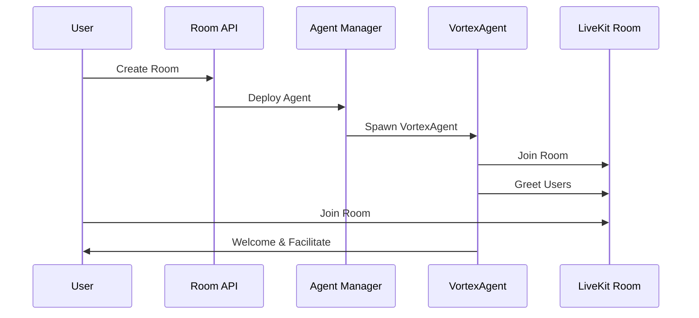

# VortexAgent Setup Guide

## Overview

VortexAgent is an intelligent GPT real-time AI host integrated into your VoiceApp chat rooms. It serves as a conversation facilitator, topic suggester, and helpful assistant that automatically joins LiveKit rooms to enhance user experience.

## Features

- 🎭 **Intelligent Hosting**: Welcomes users and facilitates natural conversations
- 🗣️ **Topic Suggestions**: Suggests interesting topics when conversations stall
- ✅ **Fact Checking**: Provides friendly verification of information
- 🤝 **Participation Encouragement**: Ensures everyone gets to contribute
- 🔄 **Smooth Transitions**: Guides conversation flow between different topics
- 🎤 **Real-time Voice**: Uses STT-LLM-TTS pipeline for natural voice interaction

## Architecture

The VortexAgent follows the LiveKit Agents framework patterns:

```
VortexAgent (Agent)
├── STT (Speech-to-Text) - Deepgram/Whisper
├── LLM (Language Model) - GPT-4o
├── TTS (Text-to-Speech) - ElevenLabs/OpenAI
├── VAD (Voice Activity Detection) - Silero
└── Turn Detection - Multilingual Model
```

## Setup Instructions

### 1. Install Dependencies

Install the agent-specific dependencies:

```bash
pip install -r agent_requirements.txt
```

### 2. Download Model Weights

Download required model weights before first run:

```bash
python vortex_agent_runner.py download-files
```

### 3. Environment Configuration

Copy the environment template and configure your API keys:

```bash
cp agent_env_template.txt .env
```

Edit `.env` with your API keys:

- **LiveKit**: Your LiveKit Cloud credentials
- **OpenAI**: For GPT-4o language model
- **Deepgram**: For speech-to-text (recommended)
- **ElevenLabs**: For high-quality text-to-speech

### 4. Verify Configuration

Test your configuration:

```bash
python vortex_agent_runner.py --check-config
```

## How It Works

### Automatic Deployment

When a new room is created via the API, the system automatically:

1. **Creates LiveKit Room**: Standard room creation process
2. **Deploys VortexAgent**: Agent manager service spawns an AI host
3. **Joins as Participant**: Agent connects with host identity
4. **Starts Conversation**: Greets users and begins facilitation

### Agent Lifecycle



### Conversation Management

The agent monitors conversation flow and:

- **Greets new participants** when they join
- **Suggests topics** during natural pauses
- **Encourages participation** from quiet members
- **Provides information** and fact-checking
- **Transitions smoothly** between discussion topics

## API Integration

### Room Creation with AI Host

When creating a room, the AI host is automatically enabled:

```json
{
  "name": "Tech Discussion",
  "topic": "Artificial Intelligence",
  "max_participants": 6,
  "is_private": false
}
```

Response includes AI host information:

```json
{
  "id": "room-uuid",
  "name": "Tech Discussion",
  "ai_host_enabled": true,
  "livekit_room_name": "room_uuid",
  "livekit_token": "user_token"
}
```

### Agent Management Endpoints

You can manage agents through the API:

```python
# Get agent status
GET /api/agents/status/{room_id}

# Update agent settings
PUT /api/agents/settings/{room_id}
{
  "personality": "professional",
  "engagement_level": 6
}

# Remove agent from room
DELETE /api/agents/{room_id}
```

## Configuration Options

### Agent Personality

Configure how the agent behaves:

```python
agent_settings = {
    "personality": "friendly",  # friendly, professional, casual
    "engagement_level": 8,      # 1-10 scale
    "intervention_threshold": 10,  # seconds before suggesting topics
    "greeting_enabled": True,
    "fact_checking_enabled": True,
    "topic_suggestions_enabled": True
}
```

### Voice Pipeline Settings

Customize the speech processing:

```python
# STT Configuration
stt=deepgram.STT(model="nova-2", language="en")

# LLM Configuration  
llm=openai.LLM(model="gpt-4o")

# TTS Configuration
tts=elevenlabs.TTS(voice="Rachel")

# VAD Configuration
vad=silero.VAD.load()

# Turn Detection
turn_detection=MultilingualModel()
```

## Testing

### Unit Tests

Run agent-specific tests:

```bash
python -m pytest tests/test_vortex_agent.py -v
```

### Integration Tests

Test with real LiveKit room:

```bash
python -m pytest tests/test_agent_integration.py -v
```

### Manual Testing

1. Create a room through the API
2. Join the room with the iOS app
3. Verify the AI host greets you
4. Test conversation features

## Monitoring

### Agent Status

Check agent health:

```bash
# View active agents
curl http://localhost:8000/api/agents/status

# View agent logs
tail -f logs/vortex_agent.log

# Monitor agent metrics
curl http://localhost:8000/api/agents/metrics
```

### Performance Metrics

The agent tracks:

- **Response Latency**: Time to generate responses
- **Conversation Quality**: Engagement metrics
- **Error Rates**: Failed interactions
- **Resource Usage**: CPU and memory consumption

## Troubleshooting

### Common Issues

**Agent Not Joining Rooms**
- Check LiveKit credentials in environment
- Verify agent runner is active
- Check room permissions

**Poor Voice Quality**
- Verify audio codec settings
- Check network connectivity
- Consider using different TTS provider

**High Latency**
- Enable preemptive generation
- Use faster STT/TTS models
- Optimize server location

**Agent Not Responding**
- Check OpenAI API key and quota
- Verify agent session is active
- Review error logs

### Debug Mode

Enable verbose logging:

```bash
export AGENT_DEBUG=true
export VERBOSE_LOGGING=true
python vortex_agent_runner.py
```

## Production Deployment

### Scaling Considerations

- **Multiple Agents**: Scale horizontally for multiple rooms
- **Resource Allocation**: Allocate sufficient CPU for AI models  
- **Load Balancing**: Distribute agent load across servers
- **Monitoring**: Set up comprehensive monitoring and alerting

### Security

- **API Key Management**: Use secure key management systems
- **Network Security**: Implement proper firewall rules
- **Content Filtering**: Enable content moderation features
- **Access Control**: Restrict agent management endpoints

## Support

For issues with VortexAgent integration:

1. Check the troubleshooting section above
2. Review agent logs for error details
3. Test with simplified configuration
4. Verify all API keys are correctly configured

## Future Enhancements

Planned improvements:

- **Multi-language Support**: Support for additional languages
- **Custom Personalities**: User-defined agent personalities  
- **Advanced Analytics**: Detailed conversation insights
- **Integration Webhooks**: Real-time event notifications
- **Mobile Agent Management**: iOS/Android agent controls 